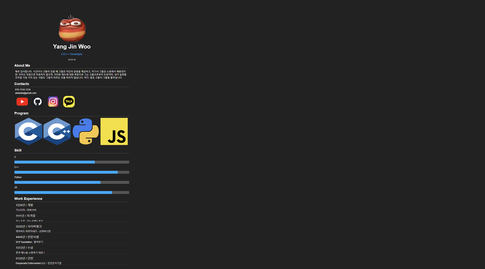

# [에이블런] [프론트엔드부트캠프] 1차시 TIL - CSS 기초 학습

## 오늘의 학습 내용

- CSS의 다양한 속성과 스타일링 기법을 학습했다.

### Float
Float 속성은 요소를 왼쪽 또는 오른쪽으로 배치하여 텍스트나 다른 요소들이 주변을 감싸게 만든다. 주로 레이아웃을 잡을 때 많이 사용되지만, flexbox와 grid가 등장하면서 사용 빈도가 줄어들고 있다.

- **Float 사용 예제**
    ```css
    .box {
        float: left;
        width: 100px;
        height: 100px;
        margin: 10px;
        background-color: lightblue;
    }
    ```

### Position
Position 속성은 요소를 문서 상에서 자유롭게 배치할 수 있게 한다. `static`, `relative`, `absolute`, `fixed`, `sticky` 값이 있으며 각각 다르게 동작한다.

- **Position 사용 예제**
    ```css
    .relative {
        position: relative;
        top: 20px;
        left: 30px;
    }

    .absolute {
        position: absolute;
        top: 50px;
        left: 100px;
    }
    ```

### Object-fit
Object-fit 속성은 이미지나 비디오 등의 콘텐츠를 특정 영역에 맞게 채울 수 있게 해준다. `fill`, `contain`, `cover`, `none`, `scale-down` 등의 값이 있다.

- **Object-fit 사용 예제**
    ```css
    .fit-container {
        width: 200px;
        height: 200px;
    }

    .fit-container img {
        width: 100%;
        height: 100%;
        object-fit: cover;
    }
    ```

### Z-index
Z-index 속성은 겹쳐있는 요소들의 z축 순서를 지정하여 어떤 요소가 위에 보이게 할지를 결정한다.

- **Z-index 사용 예제**
    ```css
    .box1 {
        position: absolute;
        z-index: 1;
        background-color: red;
        width: 100px;
        height: 100px;
    }

    .box2 {
        position: absolute;
        z-index: 2;
        background-color: blue;
        width: 100px;
        height: 100px;
        top: 50px;
        left: 50px;
    }
    ```

### Opacity
Opacity 속성은 요소의 투명도를 설정한다. 0은 완전히 투명하고 1은 불투명하다.

- **Opacity 사용 예제**
    ```css
    .transparent {
        opacity: 0.5;
    }
    ```

### Box-shadow
Box-shadow 속성은 요소에 그림자를 추가한다. 그림자의 색상, 크기, 흐림 정도 등을 설정할 수 있다.

- **Box-shadow 사용 예제**
    ```css
    .shadow {
        box-shadow: 10px 10px 5px grey;
    }
    ```

### Text-shadow
Text-shadow 속성은 텍스트에 그림자를 추가한다. 

- **Text-shadow 사용 예제**
    ```css
    .text-shadow {
        text-shadow: 2px 2px 5px red;
    }
    ```

### Border-radius
Border-radius 속성은 요소의 모서리를 둥글게 만든다. 

- **Border-radius 사용 예제**
    ```css
    .rounded {
        border-radius: 15px;
    }
    ```

### Linear-gradient
Linear-gradient는 선형 그라디언트를 적용하는 속성이다. 

- **Linear-gradient 사용 예제**
    ```css
    .gradient {
        background: linear-gradient(to right, red, yellow);
    }
    ```

### Radial-gradient
Radial-gradient는 방사형 그라디언트를 적용하는 속성이다.

- **Radial-gradient 사용 예제**
    ```css
    .radial-gradient {
        background: radial-gradient(circle, red, yellow);
    }
    ```

## 에러 발생 및 해결 방법
오늘 학습 중 발생한 에러와 그 해결 방법은 다음과 같다.

### 에러: Float 해제 문제
- **원인**: Float 속성을 사용한 요소의 부모 요소가 제대로 높이를 가지지 않아 레이아웃이 깨짐.
- **해결 방법**: 부모 요소에 `clearfix` 클래스를 추가하여 높이 문제 해결.
    ```css
    .clearfix::after {
        content: "";
        clear: both;
        display: table;
    }
    ```

### 에러: Z-index가 적용되지 않음
- **원인**: Z-index는 position 속성과 함께 사용되어야 하는데, position 속성이 지정되지 않음.
- **해결 방법**: Z-index를 적용할 요소에 position 속성을 추가.
    ```css
    .box {
        position: relative; /* 또는 absolute, fixed */
        z-index: 10;
    }
    ```

## 내 프로필 사이트 레이아웃

예시 이미지와 아이콘 이미지를 사용하여 내 프로필 사이트를 구현했다. HTML과 CSS를 사용하여 프로필 이미지, 소개글, 소셜 미디어 아이콘 등을 배치했다.



- **HTML 파일 (index.html)**
    ```html
    <!DOCTYPE html>
    <html lang="ko">
    <head>
        <meta charset="UTF-8">
        <meta name="viewport" content="width=device-width, initial-scale=1.0">
        <title>My Profile</title>
        <link rel="stylesheet" href="styles.css">
    </head>
    <body>
        <div class="container">
            <div class="profile-card">
                
                <h1>양진우</h1>
                <p>웹 개발자</p>
                <div class="social-icons">
                    <a href="#"></a>
                    <a href="#"></a>
                    <a href="#"></a>
                </div>
            </div>
        </div>
    </body>
    </html>
    ```

- **CSS 파일 (styles.css)**
    ```css
    body {
        margin: 0;
        padding: 0;
        font-family: Arial, sans-serif;
        background-color: #f4f4f9;
        display: flex;
        justify-content: center;
        align-items: center;
        height: 100vh;
    }
    
    .container {
        display: flex;
        justify-content: center;
        align-items: center;
        height: 100%;
    }
    
    .profile-card {
        background: white;
        padding: 20px;
        border-radius: 15px;
        box-shadow: 0 4px 8px rgba(0, 0, 0, 0.1);
        text-align: center;
        width: 300px;
    }
    
    .profile-img {
        width: 150px;
        height: 150px;
        border-radius: 50%;
        margin-bottom: 20px;
    }
    
    .social-icons {
        margin-top: 20px;
    }
    
    .social-icons a {
        margin: 0 10px;
        display: inline-block;
    }
    
    .social-icons img {
        width: 30px;
        height: 30px;
    }
    ```

### 코드 설명
- **HTML 파일**
  - `div.container`로 전체 레이아웃을 중앙 정렬.
  - `div.profile-card`로 프로필 카드 스타일의 레이아웃을 구성.
  - `img.profile-img` 태그로 프로필 이미지 추가.
  - `h1`, `p` 태그로 이름과 직업을 구성.
  - `div.social-icons` 내의 `a` 태그로 소셜 미디어 아이콘을 배치.

- **CSS 파일**
  - `body` 태그에 배경색과 flexbox를 사용하여 중앙 정렬.
  - `container` 클래스에 flexbox를 사용해 중앙 정렬.
  - `profile-card` 클래스에 배경 색상, 그림자, 테두리 반경 등 스타일 적용.
  - `profile-img` 클래스에 크기 조정 및 원형 테두리 추가.
  - `social-icons` 클래스에 아이콘 여백 및 크기 조정.

#### 여담

오늘은 재밌는 내용을 많이 다뤄서 좋았다. 이 수업에는 비전공자도 많아서 서브컬쳐 씹덕겜 하기 눈치가 많이 보인다. 

---

### HASHTAG
#프론트엔드 #프론트엔드개발 #프론트엔드부트캠프 #프론트엔드교육 #프론트엔드국비지원 #웹개발부트캠프 #웹개발교육 #웹개발국비지원 #에이블런부트캠프
