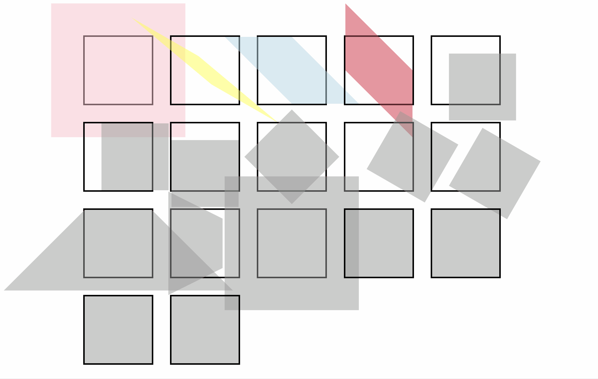
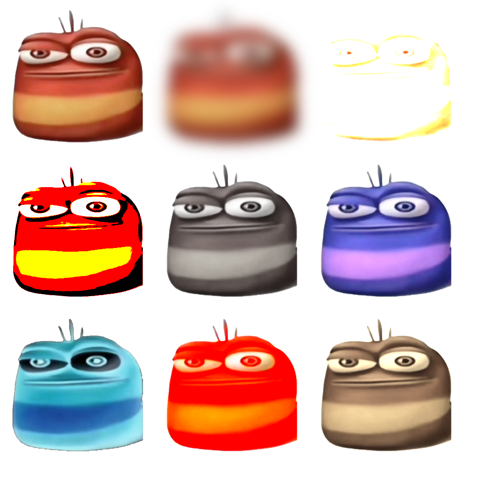

## [에이블런] [프론트엔드부트캠프] 3차시 TIL - Transition, Transform, Filter

### 오늘의 학습 내용
- Transition 속성을 활용하여 요소의 변화를 부드럽게 만드는 방법을 학습했다.
- Transform 속성을 이용해 요소를 회전, 크기 조정, 기울이기 등의 변형을 할 수 있는 방법을 배웠다.
- Filter 속성을 활용하여 이미지에 다양한 필터 효과를 적용하는 방법을 배웠다.
- Transform 속성을 이용해 3D Cube 애니메이션을 구현하는 방법을 배웠다.

### Transition
Transition 속성은 CSS에서 요소의 상태 변화가 일정 시간 동안 부드럽게 일어나도록 만들어 준다. 예를 들어, 색상, 크기, 위치 등의 변화가 순간적으로 이루어지지 않고, 지정한 시간 동안 서서히 변화하게 할 수 있다.

- **Transition 사용 예제**
    ```css
    .box {
        width: 100px;
        height: 100px;
        background-color: lightblue;
        transition: width 2s, height 2s, background-color 2s;
    }

    .box:hover {
        width: 200px;
        height: 200px;
        background-color: lightcoral;
    }
    ```

#### 코드 설명
- `transition: width 2s, height 2s, background-color 2s;`
  - `width`, `height`, `background-color` 속성이 2초 동안 서서히 변화하도록 설정했다.
- `.box:hover`
  - 마우스를 요소에 올렸을 때(`:hover` 상태), `width`, `height`, `background-color` 속성이 변화한다.

### Transform
Transform 속성을 사용하여 요소를 회전, 크기 조정, 기울이기 등의 변형을 할 수 있다. 다양한 예제를 통해 각 속성을 학습했다.



- **Transform 사용 예제**
    ```html
    <!DOCTYPE html>
    <html lang="ko">
    <head>
        <meta charset="UTF-8">
        <meta name="viewport" content="width=device-width, initial-scale=1.0">
        <link rel="stylesheet" href="styles.css">
        <title>transform</title>
    </head>
    <body>
        <article class="box1">
            <div></div>
        </article>
        <article class="box2">
            <div></div>
        </article>
        <article class="box3">
            <div></div>
        </article>
        <article class="box4">
            <div></div>
        </article>
        <article class="box5">
            <div></div>
        </article>
        <article class="box6">
            <div></div>
        </article>
        <article class="box7">
            <div></div>
        </article>
        <article class="box8">
            <div></div>
        </article>
        <article class="box9">
            <div></div>
        </article>
        <article class="box10">
            <div></div>
        </article>
        <article class="box11">
            <div></div>
        </article>
        <article class="box12">
            <div></div>
        </article>
        <article class="box13">
            <div></div>
        </article>
        <article class="box14">
            <div></div>
        </article>
        <article class="box15">
            <div></div>
        </article>
        <article class="box16">
            <div></div>
        </article>
        <article class="box17">
            <div></div>
        </article>
    </body>
    </html>
    ```

    ```css
    @charset 'UTF-8';

    * {
        margin: 0;
        padding: 0;
    }

    /* ------------------ */

    article {
        width: 200px;
        height: 200px;
        border: 5px solid #000;
        margin: 25px;
        position: relative;
        float: left;
    }

    article div {
        width: 100%;
        height: 100%;
        background-color: #999;
        opacity: 0.5;
        position: absolute;
        top: 0;
        left: 0;
    }

    article:nth-of-type(1) div {
        background-color: pink;
        opacity: 0.5;
        transform: translate(50px, 50px);
    }

    article:nth-of-type(2) div {
        background-color: lightblue;
        opacity: 0.5;
        transform: rotate(45deg);
    }

    article:nth-of-type(3) div {
        background-color: yellow;
        opacity: 0.5;
        transform: scale(1.5);
    }

    article:nth-of-type(4) div {
        background-color: crimson;
        opacity: 0.5;
        transform: skew(20deg, 20deg);
    }
    ```

### Filter
Filter 속성을 사용하여 이미지나 요소에 다양한 시각적 효과를 적용할 수 있다. 예를 들어, 흐림, 밝기 조정, 대비 조정, 색상 회전 등의 효과를 줄 수 있다.



- **Filter 사용 예제**
    ```html
    <!DOCTYPE html>
    <html lang="ko">
    <head>
        <meta charset="UTF-8">
        <meta name="viewport" content="width=device-width, initial-scale=1.0">
        <title>Document</title>
        <link rel="stylesheet" href="styles.css">
    </head>
    <body>
        <section>
            <article>
                
            </article>

            <article>
                
            </article>

            <article>
                
            </article>

            <article>
                
            </article>

            <article>
                
            </article>
            
            <article>
                
            </article>
            
            <article>
                
            </article>
            
            <article>
                
            </article>
            
            <article>
                
            </article>
        </section>
    </body>
    </html>
    ```

    ```css
    @charset 'UTF-8';

    * {
        margin: 0;
        padding: 0;
    }

    /* -------------------------------- */

    section {
        width: 660px;
        box-sizing: content-box;
    }
    section::after {
        content: '';
        display: block;
        clear: both;
    }

    article {
        float: left;
        width: 200px;
        height: 200px;
        margin: 10px;
    }

    article img {
        width: 100%;
        height: 100%;
        object-fit: fill;
    }

    article:nth-of-type(2) img {
        filter: blur(10px);
    }
    article:nth-of-type(3) img {
        filter: brightness(10);
    }
    article:nth-of-type(4) img {
        filter: contrast(100);
    }
    article:nth-of-type(5) img {
        filter: grayscale(90%);
    }
    article:nth-of-type(6) img {
        filter: hue-rotate(240deg);
    }
    article:nth-of-type(7) img {
        filter: invert(1);
    }
    article:nth-of-type(8) img {
        filter: saturate(5);
    }
    article:nth-of-type(9) img {
        filter: sepia(0.8);
    }
    ```

### Cube Transform
3D Cube Transform을 통해 요소를 3D 공간에서 회전시키는 방법을 학습했다. 이를 통해 다양한 3D 애니메이션 효과를 구현할 수 있다.


- **Cube Transform 사용 예제**
    ```html
    <!DOCTYPE html>
    <html lang="ko">
    <head>
        <meta charset="UTF-8">
        <meta name="viewport" content="width=device-width, initial-scale=1.0">
        <title>transform cube</title>
        <link rel="stylesheet" href="styles.css">
    </head>
    <body>
        <div id="wrap">
            <section>
                <article>Bocch 1</article>
                <article>Ryo   2</article>
                <article>Nijika3</article>
                <article>Kita  4</article>
                <article>5</article>
                <article>6</article>
            </section>
        </div>
        <button id="rotateButton">Rotate Cube</button>
        <script src="script.js"></script>
    </body>
    </html>
    ```

    ```css
    @charset 'UTF-8';

    /* reset */
    * {
        margin: 0;
        padding: 0;
        box-sizing: border-box;
    }

    /* ------------------------------ */

    #wrap {
        width: 400px;
        height: 400px;
        margin: 100px auto;
        perspective: 1000px;
    }

    #wrap section {
        width: 100%;
        height: 100%;
        position: relative;
        transform-style: preserve-3d;
        transform: rotateX(0deg) rotateY(0deg);
        transition: transform 1s;
    }

    #wrap:hover section {
        transform: rotateX(360deg) rotateY(360deg);
    }

    #wrap section article {
        width: 400px;
        height: 400px;
        position: absolute;
        font: bold 100px/400px arial;
        color: #5c10ff;
        text-align: center;
        opacity: 0.9;
    }

    #wrap section article:nth-of-type(1) {
        background-color: pink;
        transform: translateZ(200px);
    }
    #wrap section article:nth-of-type(2) {
        background-color: lightblue;
        transform: rotateY(90deg) translateZ(200px);
    }
    #wrap section article:nth-of-type(3) {
        background-color: yellow;
        transform: rotateY(180deg) translateZ(200px);
    }
    #wrap section article:nth-of-type(4) {
        background-color: crimson;
        transform: rotateY(-90deg) translateZ(200px);
    }
    #wrap section article:nth-of-type(5) {
        background-color: darkmagenta;
        transform: rotateX(90deg) translateZ(200px);
    }
    #wrap section article:nth-of-type(6) {
        background-color: rgb(21, 4, 37);
        transform: rotateX(-90deg) translateZ(200px);
    }

    button {
        display: block;
        margin: 200px auto;
        padding: 20px 40px;
        font-size: 16px;
        cursor: pointer;
    }
    ```

    ```javascript
    let currentX = 0;
    let currentY = 0;

    document.getElementById('rotateButton').addEventListener('click', () => {
        const angles = [0, 90, 180, 270];
        
        const randomX = angles[Math.floor(Math.random() * angles.length)] + 5 * 360;
        const randomY = angles[Math.floor(Math.random() * angles.length)] + 5 * 360;
        
        currentX += randomX;
        currentY += randomY;
        
        const section = document.querySelector('#wrap section');
        section.style.transform = `rotateX(${currentX}deg) rotateY(${currentY}deg)`;
    });
    ```

#### 코드 설명
- **HTML**
  - `div#wrap` 내부에 6개의 `article` 요소를 포함한 `section`을 배치.
  - `button`을 클릭할 때마다 Cube가 회전하도록 설정.

- **CSS**
  - `#wrap`에 `perspective`를 적용하여 3D 효과를 구현.
  - `section` 요소에 `transform-style: preserve-3d`를 적용하여 3D 회전이 가능하도록 설정.
  - 각 `article` 요소에 배경 색상과 위치를 설정하여 Cube의 각 면을 구성.

- **JavaScript**
  - `rotateButton` 클릭 시 Cube가 무작위 각도로 회전하도록 설정.
  - `transform` 속성을 이용하여 `rotateX`와 `rotateY` 값을 변경.

### 에러 발생 및 해결
3D Cube Transform을 구현할 때, 각 면이 제대로 정렬되지 않거나 회전 시 부자연스러운 경우가 발생할 수 있다. 이를 해결하기 위해서는 `transform-origin`과 `transform-style` 속성을 적절히 설정해야 한다.

- **에러 해결 예제**
    ```css
    #wrap section {
        width: 100%;
        height: 100%;
        position: relative;
        transform-style: preserve-3d;
        transform-origin: center;
        transition: transform 1s;
    }
    ```

### 핵심
- Transition과 Transform을 함께 사용하여 복잡한 애니메이션을 구현할 수 있다.
- `animation` 속성과 함께 사용하여 다양한 애니메이션 효과를 추가할 수 있다.
- Filter 속성을 사용하여 이미지에 다양한 시각적 효과를 추가할 수 있다.

### 여담

오늘배운 내용중 Transition은 개인적으로 매우 복잡한 속성을 갖는다. <br>이해가 안되는건 아니지만 사용하려면 두통을 감수해야할 필요가 있다.

### HASHTAG
#프론트엔드 #프론트엔드개발 #프론트엔드부트캠프 #프론트엔드교육 #프론트엔드국비지원 #웹개발부트캠프 #웹개발교육 #웹개발국비지원 #에이블런부트캠프
