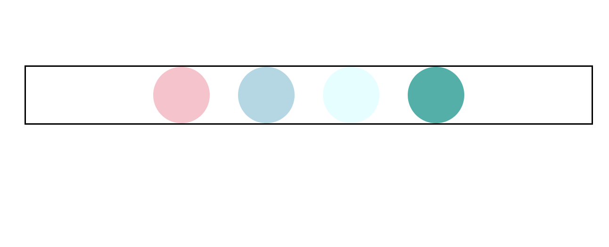
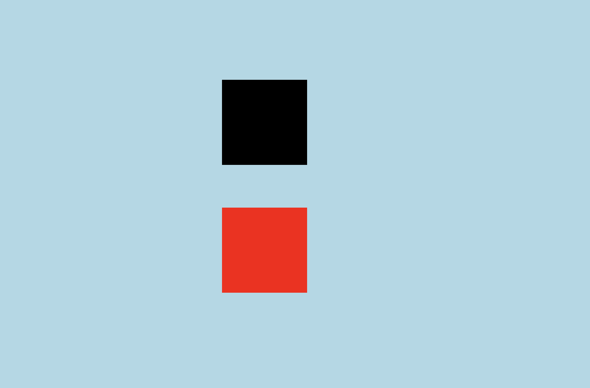
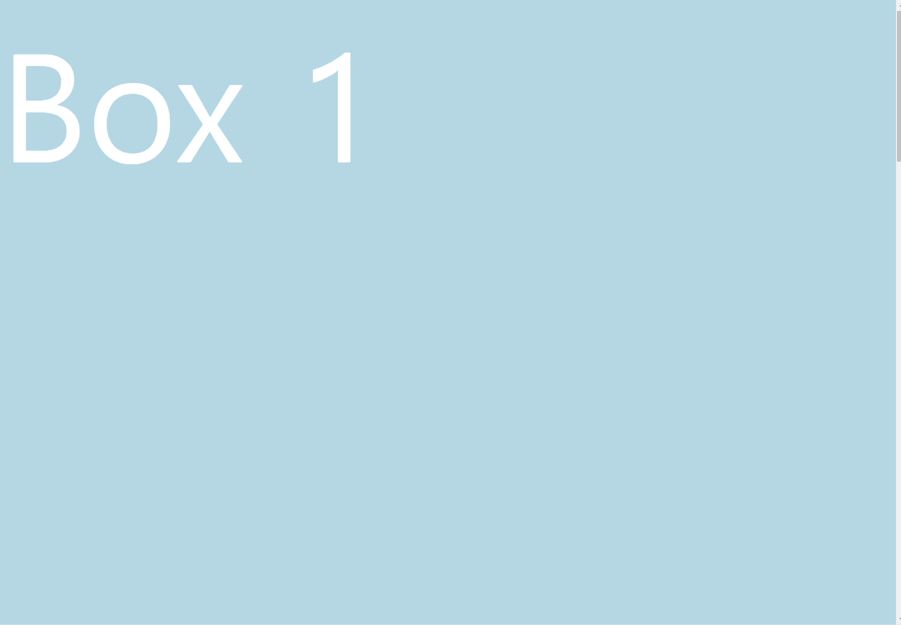
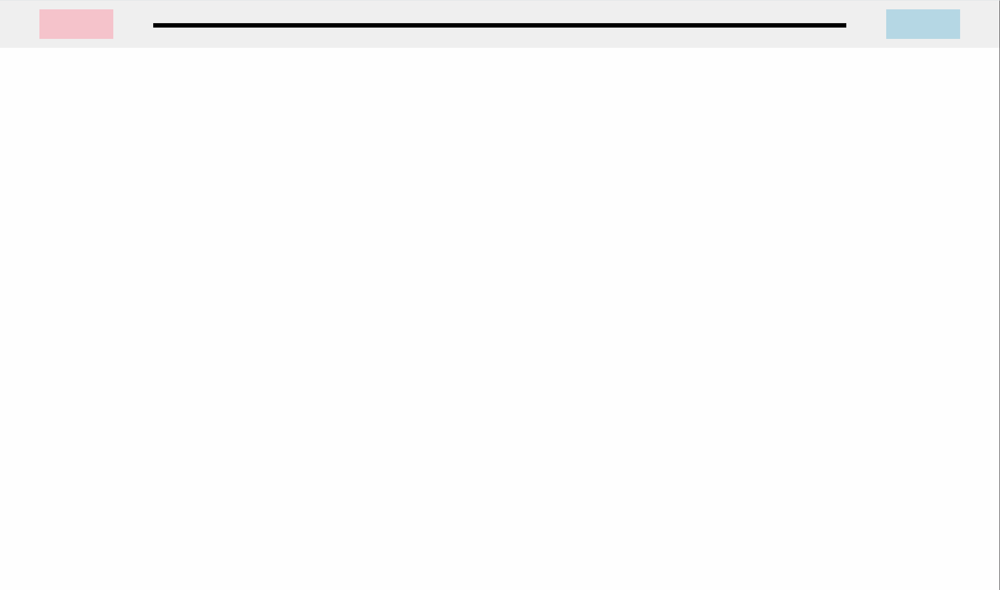

# [에이블런] [프론트엔드부트캠프] 4차시 TIL

### 오늘의 학습 내용
오늘 배운 내용은 다음과 같다. inline 요소의 간격 버그 해결, margin 역상속의 이해와 해결 방법, fullscreen layout 제작 방법, fullscreen으로 배경 채우기, calc 사용법, absolute 활용 영상 fullscreen 제작, layout 사이트 제작.

## 1. inline요소의 간격버그 해결

### 문제 상황
HTML에서 inline 요소들 사이에 공백이 생기는 버그가 발생할 수 있다. 이 문제는 주로 요소 사이의 공백 문자 때문에 발생한다.

### 해결 방법
`font-size`를 0으로 설정하여 공백을 제거하고, `inline-block`을 사용하여 요소를 나란히 배치한다.



```html
<!DOCTYPE html>
<html lang="ko">
<head>
    <meta charset="UTF-8">
    <meta name="viewport" content="width=device-width, initial-scale=1.0">
    <link rel="stylesheet" href="style.css">
    <title>Inline 요소 간격 버그 해결</title>
</head>
<body>
    <div class="others">
        <a href="#"></a>
        <a href="#"></a>
        <a href="#"></a>
        <a href="#"></a>
    </div>
</body>
</html>
```

```css
.others {
    width: 400px;
    border: 1px solid black;
    margin: 50px auto;
    text-align: center;
    font-size: 0;
}

.others a {
    display: inline-block;
    width: 40px;
    height: 40px;
    border-radius: 20px;
    background: pink;
    margin: 0 10px;
}

.others a:nth-of-type(2) {
    background: lightblue;
}

.others a:nth-of-type(3) {
    background: lightcyan;
}

.others a:nth-of-type(4) {
    background: lightseagreen;
}
```

### 핵심 명령어
- `font-size: 0;`: 요소들 사이의 공백을 제거한다.
- `display: inline-block;`: inline 요소의 성격을 유지하면서 block 요소처럼 동작하게 한다.

## 2. margin 역상속의 이해와 해결 방법

### 문제 상황
부모 요소의 `margin`이 자식 요소에게 영향을 미쳐서 레이아웃이 의도치 않게 흐트러질 수 있다.

### 해결 방법
부모 요소와 자식 요소의 margin과 padding을 초기화하고, 필요한 요소에만 margin을 지정한다.



```html
<!DOCTYPE html>
<html lang="ko">
<head>
    <meta charset="UTF-8">
    <meta name="viewport" content="width=device-width, initial-scale=1.0">
    <link rel="stylesheet" href="style.css">
    <title>Margin 역상속 해결</title>
</head>
<body>
    <section>
        <div class="box1"></div>
        <div class="box2"></div>
    </section>
</body>
</html>
```

```css
@charset 'UTF-8';

* {
    margin: 0;
    padding: 0;
}

section {
    width: 100%;
    height: 100vh;
    background: lightblue;
    padding-top: 200px;
}

.box1 {
    width: 200px;
    height: 200px;
    background: #000;
    margin: 0 auto;
}

.box2 {
    width: 200px;
    height: 200px;
    background: red;
    margin: 100px auto;
}
```

### 핵심 명령어
- `* { margin: 0; padding: 0; }`: 모든 요소의 기본 margin과 padding을 초기화한다.
- `margin: 0 auto;`: 요소를 수평으로 중앙에 배치한다.

## 3. fullscreen layout 제작 방법

### 목표
브라우저 창 전체를 차지하는 레이아웃을 제작한다.



```html
<!DOCTYPE html>
<html lang="ko">
<head>
    <meta charset="UTF-8">
    <meta name="viewport" content="width=device-width, initial-scale=1.0">
    <link rel="stylesheet" href="style.css">
    <title>Fullscreen Layout</title>
</head>
<body>
    <section class="box1">
        <span>Box 1</span>
    </section>
    <section class="box2">
        <span>Box 2</span>
    </section>
    <section class="box3">
        <span>Box 3</span>
    </section>
    <section class="box4">
        <span>Box 4</span>
    </section>
</body>
</html>
```

```css
@charset 'UTF-8';

* {
    margin: 0;
    padding: 0;
}

section {
    width: 100%;
    height: 100vh;
}

.box1 {
    background: lightblue;
}

.box1 span {
    color: white;
    font-size: 200px;
}

.box2 {
    background: lightgreen;
}

.box2 span {
    color: white;
    font-size: 20vw;
}

.box3 {
    background: orange;
}

.box3 span {
    color: white;
    font-size: 20vh;
}

.box4 {
    background: pink;
}
```

### 핵심 명령어
- `width: 100%; height: 100vh;`: 요소가 브라우저 창의 전체 너비와 높이를 차지하게 한다.
- `font-size: 20vw;`: 뷰포트 너비를 기준으로 글자 크기를 설정한다.
- `font-size: 20vh;`: 뷰포트 높이를 기준으로 글자 크기를 설정한다.

## 4. fullscreen으로 배경 채우기

### 목표
배경 이미지를 브라우저 창 전체에 채운다.


```html
<!DOCTYPE html>
<html lang="ko">
<head>
    <meta charset="UTF-8">
    <meta name="viewport" content="width=device-width, initial-scale=1.0">
    <link rel="stylesheet" href="style.css">
    <title>Fullscreen Background</title>
</head>
<body>
    <section class="box1"></section>
    <section class="box2"></section>
    <section class="box3"></section>
    <section class="box4"></section>
    <section class="box5"></section>
</body>
</html>
```

```css
@charset 'UTF-8';

* {
    margin: 0;
    padding: 0;
}

section {
    width: 100%;
    height: 100vh;
    background: rebeccapurple;
    background-repeat: no-repeat;
    background-position: center center;
    background-size: cover;
}

.box1 {
    background-image: url('img/image1.png');
}

.box2 {
    background-image: url('img/image2.png');
}

.box3 {
    background-image: url('img/image3.png');
    background-attachment: fixed;
}

.box4 {
    background-image: url('img/image4.png');
}

.box5 {
    background-image: url('img/image5.png');
}
```

### 핵심 명령어
- `background-size: cover;`: 배경 이미지를 요소의 크기에 맞춰서 조정한다.
- `background-attachment: fixed;`: 배경 이미지를 고정시켜 스크롤 시에도 움직이지 않게 한다.

## 5. calc 사용법

### 목표
CSS에서 `calc`를 사용하여 동적인 계산을 한다.



```html
<!DOCTYPE html>
<html lang="ko">
<head>
    <meta charset="UTF-8">
    <meta name="viewport" content="width=device-width, initial-scale=1.0">
    <link rel="stylesheet" href="style.css">
    <title>CSS calc 사용법</title>
</head>
<body>
    <section>
        <div class="box1"></div>
        <div class="box2"></div>
    </section>
</body>
</html>
```

```css
@charset 'UTF-8';

* {
    padding: 0;
    margin: 0;
}

section {
    width: 100%;
    height: 8vh;
    position: relative;
    background: #efefef;
}

section::after {
    content: '';
    display: block;
    width: calc(100% - 4vw - 100px - 4vw - 4vw - 100px - 4vw);
    height: 6px;
    background: #000;
    top: 50%;
    margin-top: -1px;
    left: calc(4vw + 100px + 4vw);
    position: absolute;
}

.box1 {
    width: 100px;
    height: 40px;
    background: pink;
    position: absolute;
    left: 4vw;
    top: 50%;
    transform: translateY(-50%);
}

.box2 {
    width: 100px;
    height: 40px;
    background: lightblue;
    position: absolute;
    right: 4vw;
    top: 50%;
    transform: translateY(-50%);
}
```

### 핵심 명령어
- `calc()`: CSS에서 동적 계산을 수행할 수 있게 해준다.
- `transform: translateY(-50%);`: 요소를 수직 중앙에 배치한다.

## 6. absolute 활용 fullscreen 제작

### 목표
`absolute`를 활용하여 비디오를 배경으로 하는 fullscreen 레이아웃을 제작한다


```html
<!DOCTYPE html>
<html lang="ko">
<head>
    <meta charset="UTF-8">
    <meta name="viewport" content="width=device-width, initial-scale=1.0">
    <title>absolute 활용 fullscreen</title>
    <link rel="stylesheet" href="style.css">
    <link rel="stylesheet" href="https://cdnjs.cloudflare.com/ajax/libs/font-awesome/6.6.0/css/all.min.css" integrity="sha512-Kc323vGBEqzTmouAECnVceyQqyqdsSiqLQISBL29aUW4U/M7pSPA/gEUZQqv1cwx4OnYxTxve5UMg5GT6L4JJg==" crossorigin="anonymous" referrerpolicy="no-referrer" />
</head>
<body>
    <header>
        <h1>VIBE</h1>
        <ul id="gnb">
            <li><a href="#">company</a></li>
            <li><a href="#">brand</a></li>
            <li><a href="#">gallery</a></li>
            <li><a href="#">community</a></li>
            <li><a href="#">news</a></li>
            <li><a href="#">location</a></li>
        </ul>
        <ul class="sns">
            <li><a href="#"><i class="fas fa-search"></i></a></li>
            <li><a href="#"><i class="far fa-envelope"></i></a></li>
            <li><a href="#"><i class="fab fa-instagram"></i></a></li>
        </ul>
    </header>
    <figure>
        <video src="img/video.mp4" muted autoplay loop></video>
        <article class="text">
            <p>Bocchi the <br> ROCK</p>
            <ul>
                <li><i class="fab fas fa-film"></i><strong>watch film</strong></li>
                <li><i class="far fas fa-guitar"></i><strong>Favorite item</strong></li>
            </ul>
        </article>
    </figure>
    <footer>2024 VIBE &copy; All rights reserved.</footer>
</body>
</html>
```

```css
@charset 'UTF-8';
@import url('https://fonts.googleapis.com/css2?family=Kalnia+Glaze:wght@100..700&display=swap');
@import url('https://fonts.googleapis.com/css2?family=Pacifico&display=swap');

* {
    padding: 0;
    margin: 0;
    box-sizing: border-box;
}

a {
    text-decoration: none;
}

ul, ol, li {
    list-style: none;
}

header {
    width: 100%;
    height: 10vh;
    border-bottom: 1px solid #888;
    position: absolute;
    z-index: 1;
}

header h1 {
    position: absolute;
    font: bold 24px/1 "Pacifico";
    color: rgb(255, 0, 0);
    top: 50%;
    left: 20px;
    margin-top: -12px;
}

header #gnb {
    position: absolute;
    top: 40%;
    left: 50%;
    transform: translate(-50%, -50%);
}

header #gnb li {
    float: left;
    margin-right: 20px;
}

header #gnb li a {
    font: normal 16px/1 "Architects Daughter";
    color: rgb(255, 0, 0);
    letter-spacing: 1px;
}

header .sns {
    position: absolute;
    right: 6vw;
    top: 40%;
    margin-top: -8px;
}

header .sns li {
    float: left;
    margin-left: 20px;
}

header .sns li a {
    font-size: 16px;
    color: rgb(255, 0, 0);
}

figure {
    width: 100%;
    height: 100vh;
    background: black;
    position: absolute;
    left: 0;
    top: 0;
    z-index: -1;
    overflow: hidden;
}

figure video {
    width: 100%;
    height: 100%;
    object-fit: cover;
    opacity: 0.8;
}

figure .text p {
    z-index: 1;
    position: absolute;
    top: 30%;
    left: 10%;
    color: white;
    font: bold 100px/1 "Kalnia Glaze";
}

figure .text ul {
    z-index: 1;
    position: absolute;
    margin-top: 30px;
    top: 60%;
    left: 10%;
    color: white;
    font: bold 30px/1 "Kalnia Glaze";
}

figure .text ul li {
    float: left;
    margin-left: 30px;
}

figure .text ul li i {
    font-size: 20px;
    color: white;
    margin-right: 20px;
}

figure .text ul li strong {
    font: 14px/1 arial;
    color: white;
    letter-spacing: 1px;
}

footer {
    position: absolute;
    bottom: 5vh;
    left: 50%;
    transform: translateX(-50%);
    font: 12px/1 arial;
    color: white;
    letter-spacing: 2px;
}
```

### 핵심 명령어
- `position: absolute;`: 요소를 절대 위치로 배치한다.
- `z-index: -1;`: 요소의 쌓임 순서를 조정하여 뒤로 배치한다.
- `object-fit: cover;`: 비디오나 이미지를 요소의 크기에 맞춰 자르거나 늘려서 꽉 채운다.

## 7. layout 제작 (사이트 제작)

### 목표
웹사이트의 기본 레이아웃을 제작한다.


```html
<!DOCTYPE html>
<html lang="ko">
<head>
    <meta charset="UTF-8">
    <meta name="viewport" content="width=device-width, initial-scale=1.0">
    <title>Layout 크리에이팅</title>
    <link rel="stylesheet" href="style.css">
</head>
<body>
    <section>
        <div class="wrap">
            <h1>ZZZ</h1>
            <p>asdfsadfasdf</p>
            <div class="inner">
                <article>
                    <div class="pic"></div>
                    <h2>Cunning Hares AKA Gentle House</h2>
                    <p>Lorem ipsum dolor sit amet consectetur adipisicing elit. Nemo?</p>
                    <a href="#">view</a>
                </article>
                <article>
                    <div class="pic"></div>
                    <h2>Belobog Heavy Industries</h2>
                    <p>Lorem ipsum dolor sit amet consectetur adipisicing elit. Nemo?</p>
                    <a href="#">view</a>
                </article>
                <article>
                    <div class="pic"></div>
                    <h2>Victoria Housekeeping Co. </h2>
                    <p>Lorem ipsum dolor sit amet consectetur adipisicing elit. Nemo?</p>
                    <a href="#">view</a>
                </article>
                <article>
                    <div class="pic"></div>
                    <h2>Faction Unknown</h2>
                    <p>Lorem ipsum dolor sit amet consectetur adipisicing elit. Nemo?</p>
                    <a href="#">view</a>
                </article>
            </div>
        </div>
    </section>
</body>
</html>
```

```css
@charset 'UTF-8';

* {
    padding: 0;
    margin: 0;
}

a {
    text-decoration: none;
}

ul, ol, li {
    list-style: none;
}

section {
    width: 100%;
    background: #ddd;
    padding: 180px 0;
    position: relative;
}

section .wrap {
    width: 1180px;
    margin: 0 auto;
}

section .wrap h1 {
    font: bold 22px/1 arial;
    color: #555;
    text-align: center;
    margin-bottom: 10px;
}

section .wrap > p {
    text-align: center;
    font: bold 12px/1 arial;
    color: #777;
    margin-bottom: 80px;
}

section .wrap .inner {
    width: 100%;
}

section .wrap .inner::after {
    content: '';
    display: block;
    clear: both;
}

section .wrap .inner article {
    width: 280px;
    margin-right: 20px;
    float: left;
    background: none;
}

section .wrap .inner article:last-child {
    margin-right: 0;
}

section .wrap .inner .pic {
    width: 100%;
    height: 130px;
    background: black;
    margin-bottom: 20px;
    overflow: hidden;
}

section .wrap .inner article .pic:hover img {
    transform: scale(1.2);
    opacity: 1;
    transition: all 1s;
}

section .wrap .inner article:nth-of-type(2) .pic:hover img {
    transform: skew(30deg);
    opacity: 1;
    transition: all 1s;
}

section .wrap .inner article:nth-of-type(3) .pic:hover img {
    transform: translate(10px, 20px);
    opacity: 1;
    transition: all 1s;
}

section .wrap .inner article:nth-of-type(4) .pic:hover img {
    transform: rotate(90deg);
    opacity: 1;
    transition: all 1s;
}

section .wrap .inner .pic

 img {
    width: 100%;
    height: 100%;
    object-fit: cover;
    transform: scale(1);
    opacity: 0;
    transition: all 1s;
}

section .wrap .inner article h2 {
    margin-bottom: 10px;
}

section .wrap .inner article > p {
    margin-bottom: 20px;
    color: black;
    font: normal 15px/1.2 arial;
}

section .wrap .inner article > a {
    display: inline-block;
    margin-bottom: 20px;
    border: 1px solid black;
    width: 100px;
    height: 30px;
    color: black;
    font: bold 15px/1 arial;
    text-align: center;
    line-height: 30px;
}
```

### 핵심 명령어
- `width: 100%;`: 요소가 부모 요소의 전체 너비를 차지하게 한다.
- `margin: 0 auto;`: 요소를 수평으로 중앙에 배치한다.
- `transform: scale(1.2);`: 요소를 1.2배 확대한다.
- `transition: all 1s;`: 모든 속성의 변화를 1초 동안 부드럽게 전환한다.

#### 여담

오늘은 비가 많이 내려서 도로가 침수된 관계로 Zoom을 통하여 화상수업을 진행했다. <br>오늘의 내용은 실전활용에 있어서 매우 중요한 내용이였던것 같다.

## 해시태그
#프론트엔드 #프론트엔드개발 #프론트엔드부트캠프 #프론트엔드교육 #프론트엔드국비지원 #웹개발부트캠프 #웹개발교육 #웹개발국비지원 #에이블런부트캠프
