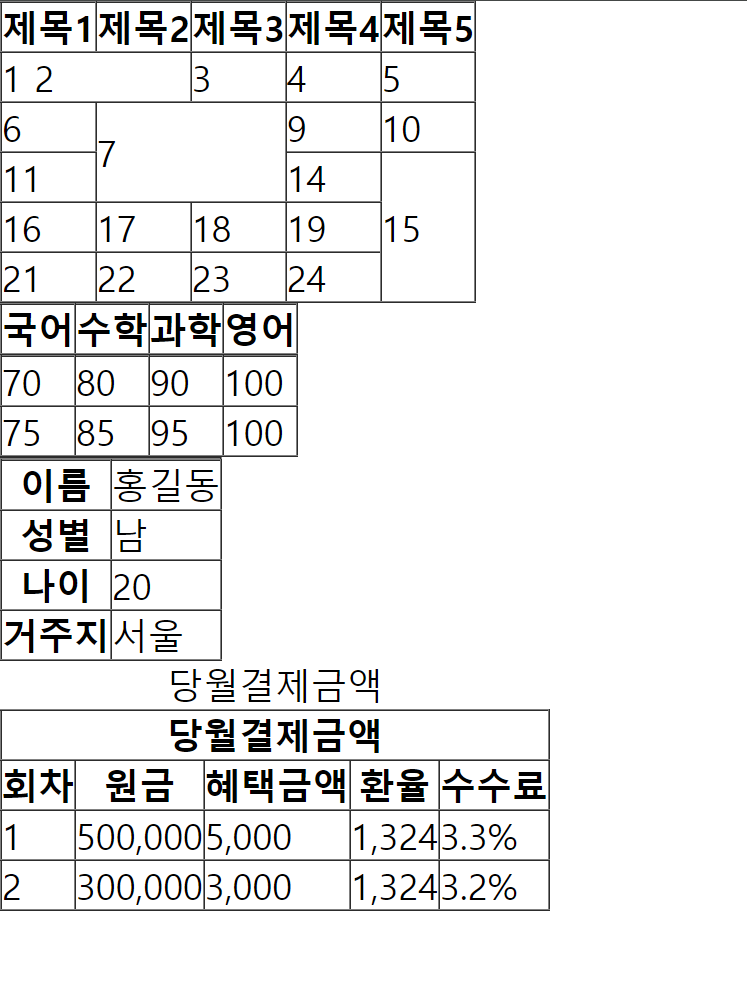
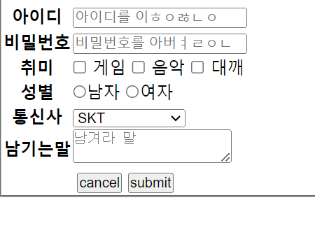
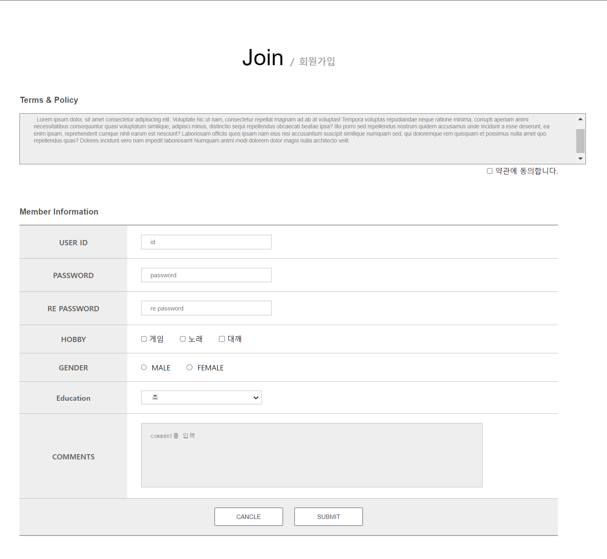

# [에이블런] [프론트엔드부트캠프] 2주차 1차시 TIL

## 학습 내용 요약

이번 2주차 1차시에서는 프론트엔드 개발의 기본 요소들을 학습하였다. 주요 내용은 다음과 같다:

1. **Table**
   - HTML `<table>`, `<tr>`, `<td>`, `<th>` 태그 사용 및 셀 병합 방법 학습.
   - 테이블의 구조적 데이터 표현과 CSS 스타일링 방법 익힘.

2. **Form 요소**
   - `<form>`, `<input>`, `<label>`, `<select>`, `<textarea>` 태그를 이용한 폼 구성 학습.
   - 폼 요소의 레이아웃과 스타일링, 데이터 전송 방법 익힘.

3. **회원가입**
   - 회원가입 폼 구현 및 스타일링 학습.
   - 입력 유효성 검사와 사용자 경험 개선 방법 익힘.


## 1. Table

### 학습 내용
Table 요소를 활용하여 데이터를 구조적으로 표현하는 방법에 대해 배웠다. HTML의 `<table>`, `<tr>`, `<td>`, `<th>` 태그를 사용하여 표를 만들고, CSS를 통해 표의 스타일을 지정하는 방법을 익혔다.



### 예시 코드
HTML:
```html
<!DOCTYPE html>
<html lang="ko">
<head>
    <meta charset="UTF-8">
    <meta name="viewport" content="width=device-width, initial-scale=1.0">
    <title>table</title>
    <link rel="stylesheet" href="styles.css">
</head>
<body>
    <table border="1" class="table">
        <tr>
            <th>제목1</th>
            <th>제목2</th>
            <th>제목3</th>
            <th>제목4</th>
            <th>제목5</th>
        </tr>
        <tr>
            <td colspan="2">1 2</td>
            <td>3</td>
            <td>4</td>
            <td>5</td>
        </tr>
        <tr>
            <td>6</td>
            <td colspan="2" rowspan="2">7</td>  
            <td>9</td>
            <td>10</td>
        </tr>
        <tr>
            <td>11</td>
            <td>14</td>
            <td rowspan="3">15</td>
        </tr>
        <tr>
            <td>16</td>
            <td>17</td>
            <td>18</td>
            <td>19</td>
        </tr>
        <tr>
            <td>21</td>
            <td>22</td>
            <td>23</td>
            <td>24</td>
        </tr>
    </table>

    <table class="table" border="1">
        <caption class="h">A반의 시험성적</caption>
        <thead>
            <tr>
                <th>국어</th>
                <th>수학</th>
                <th>과학</th>
                <th>영어</th>
            </tr>
        </thead>
        <tbody>
            <tr>
                <td>70</td>
                <td>80</td>
                <td>90</td>
                <td>100</td>
            </tr>
            <tr>
                <td>75</td>
                <td>85</td>
                <td>95</td>
                <td>100</td>
            </tr>
        </tbody>
    </table>
    
    <table border="1">
        <caption class="h">회원정보</caption>
        <tr>
            <th scope="row">이름</th>
            <td>홍길동</td>
        </tr>
        <tr>
            <th scope="row">성별</th>
            <td>남</td>
        </tr>
        <tr>
            <th scope="row">나이</th>
            <td>20</td>
        </tr>
        <tr>
            <th scope="row">거주지</th>
            <td>서울</td>
        </tr>
    </table>
    
    <table class="table4" border="1">
        <caption>당월결제금액</caption>
        <thead>
            <tr>
                <th colspan="5" id="a1">당월결제금액</th>
            </tr>
            <tr>
                <th id="b1">회차</th>
                <th id="b2">원금</th>
                <th id="b3">혜택금액</th>
                <th id="b4">환율</th>
                <th id="b5">수수료</th>
            </tr>
        </thead>
        <tbody>
            <tr>
                <td headers="a1 b1">1</td>
                <td headers="a1 b2">500,000</td>
                <td headers="a1 b3">5,000</td>
                <td headers="a1 b4">1,324</td>
                <td headers="a1 b5">3.3%</td>
            </tr>
            <tr>
                <td headers="a1 b1">2</td>
                <td headers="a1 b2">300,000</td>
                <td headers="a1 b3">3,000</td>
                <td headers="a1 b4">1,324</td>
                <td headers="a1 b5">3.2%</td>
            </tr>
        </tbody>
    </table>
</body>
</html>
```

CSS:
```css
@import url(reset.css);

/* tr */
table {
    border-collapse: collapse;
}

/* 
thead : 테이블의 제목 셀그룹 
tbody : 테이블의 본문 
tfoot : 테이블 내용의 소계, 합계 정보

scope 제목셀과 내용셀의 관계를 지정 
데이터의 의미와 관계를 파악하기 쉽게 만듬 
th에 scope지정 (row/ col) 
*/

.h {
    position: absolute;
    top: -9999px;
    opacity: 0;
}
```

## 2. Form 요소

### 학습 내용
Form 요소를 이용하여 사용자 입력을 받는 방법을 배웠다. `<form>`, `<input>`, `<label>`, `<select>`, `<textarea>` 등의 태그를 사용하여 다양한 입력 폼을 만드는 방법을 학습하였다.



### 예시 코드
HTML:
```html
<!DOCTYPE html>
<html lang="ko">
<head>
    <meta charset="UTF-8">
    <meta name="viewport" content="width=device-width, initial-scale=1.0">
    <title>Document</title>
    <link rel="stylesheet" href="styles.css">
</head>
<body>
    <form action="result.html" method="get">
        <fieldset>
            <legend class="h">회원가입입력양식폼</legend>
            
            <table>
                <caption class="h">회원가입입력양식테이블</caption>
                <tr>
                    <th scope="row"><label for="id">아이디</label></th>
                    <td><input type="text" name="id" id="id" placeholder="아이디를 입력"></td>
                </tr>
                <tr>
                    <th scope="row"><label for="pwd">비밀번호</label></th>
                    <td><input type="password" name="pwd" id="pwd" placeholder="비밀번호를 입력"></td>
                </tr>
                <tr>
                    <th scope="row">취미</th>
                    <td>
                        <input type="checkbox" name="hobby" id="game" value="game"> <label for="game">게임</label>
                        <input type="checkbox" name="hobby" id="music" value="music"> <label for="music">음악</label>
                        <input type="checkbox" name="hobby" id="coding" value="coding"> <label for="coding">코딩</label>
                    </td>
                </tr>
                <tr>
                    <th scope="row">성별</th>
                    <td>
                        <input type="radio" name="gender" id="male" value="male"><label for="male">남자</label>
                        <input type="radio" name="gender" id="female" value="female"><label for="female">여자</label>
                    </td>
                </tr>
                <tr>
                    <th scope="row"><label for="company">통신사</label></th>
                    <td>
                        <select name="company" id="company">
                            <option value="" disabled>통신사를 선택</option>
                            <option value="SKT">SKT</option>
                            <option value="KT">KT</option>
                            <option value="LGU+">LGU+</option>
                        </select>
                    </td>
                </tr>
                <tr>
                    <th scope="row"><label for="comments">남기는말</label></th>
                    <td><textarea name="comments" id="comments" placeholder="남길 말"></textarea></td>
                </tr>   
                <tr>
                    <th colspan="2">
                        <input type="reset" value="cancel">
                        <input type="submit" value="submit">
                    </th>
                </tr>
            </table>
        </fieldset>
    </form>
</body>
</html>
```

CSS:
```css
@import url(reset.css);

.h {
    position: absolute;
    top: -9999px;
    opacity: 0;
}

/* 인풋요소(form태그) - 사용자가 특정 정보

값을 입력받기 위한 태그 
   모든 인풋요소는 form태그로 감싸야 한다 
   action은 입력정보들을 보낼 위치를 지정 
   method는 입력정보들을 보내는 방식 
   fieldset - 입력정보 그룹화 
   legend - form의 정보 
   value - 실제 서버에 전송할 값 
   name - value의 네임태그
   name="value" 형식으로 전송 
   checkbox - 여러개 선택가능 
   radio - 무조건 하나만 선택가능 */
form {
    max-width: 600px;
    margin: 0 auto;
    padding: 20px;
    border: 1px solid #ccc;
    border-radius: 10px;
}

label {
    display: block;
    margin-bottom: 8px;
    font-weight: bold;
}

input[type="text"],
input[type="password"],
input[type="email"],
input[type="number"],
textarea,
select {
    width: 100%;
    padding: 8px;
    margin-bottom: 16px;
    border: 1px solid #ccc;
    border-radius: 4px;
}
```

## 3. 회원가입

### 학습 내용
회원가입 폼을 구현하여 사용자로부터 정보를 입력받고, 이를 서버로 전송하는 방법을 배웠다.



### 예시 코드
HTML:
```html
<!DOCTYPE html>
<html lang="ko">
<head>
    <meta charset="UTF-8">
    <meta name="viewport" content="width=device-width, initial-scale=1.0">
    <title>Document</title>
    <link rel="stylesheet" href="styles.css">
</head>
<body>
    <section class="join">
        <div class="inner">
            <h1>
                Join
                <span>회원가입</span>
            </h1>
            <form action="result.html" method="post">
                <fieldset>
                    <legend class="h">회원가입양식폼</legend>
                    
                    <h2><label for="terms">Terms & Policy</label></h2>
                    <textarea name="terms" id="terms" spellcheck="false">  Lorem ipsum dolor, sit amet consectetur adipisicing elit. Voluptate hic ut nam, consectetur repellat magnam ad ab at voluptas! Tempora voluptas repudiandae neque ratione minima, corrupti aperiam animi necessitatibus consequuntur quasi voluptatum similique, adipisci minus, distinctio sequi repellendus obcaecati beatae ipsa? Illo porro sed repellendus nostrum quidem accusamus unde incidunt a esse deserunt, ea enim ipsam, reprehenderit cumque nihil earum est nesciunt? Laboriosam officiis quos ipsam nam eius nisi accusantium suscipit similique numquam sed, qui doloremque rem quisquam et possimus nulla amet quo repellendus quas? Dolores incidunt vero nam impedit laboriosam! Numquam animi modi dolorem dolor magni nulla architecto velit.
                    </textarea>
                    <div class="agreement">
                        <input type="checkbox" name="agree" id="agree">
                        <label for="agree">약관에 동의합니다.</label>
                    </div>
                    <h2>Member Information</h2>
                    <table>
                        <caption class="h">회원정보입력양식테이블</caption>
                        <tr>
                            <th scope="row"><label for="id">USER ID</label></th>
                            <td>
                                <input type="text" name="id" id="id" placeholder="id" required>
                            </td>
                        </tr>
                        <tr>
                            <th scope="row"><label for="pass1">PASSWORD</label></th>
                            <td>
                                <input type="password" name="pass1" id="pass1" placeholder="password" required>
                            </td>
                        </tr>
                        <tr>
                            <th scope="row"><label for="pass2">RE PASSWORD</label></th>
                            <td>
                                <input type="password" name="pass2" id="pass2" placeholder="re password" required>
                            </td>
                        </tr>
                        <tr>
                            <th scope="row"><label for="hobby">HOBBY</label></th>
                            <td>
                                <label for="game"><input type="checkbox" name="hobby" id="game" value="game">게임</label>
                                <label for="music"><input type="checkbox" name="hobby" id="music" value="music">노래</label>
                                <label for="coding"><input type="checkbox" name="hobby" id="coding" value="coding">대깨</label>
                                <p>취미를 하나이상 선택해 주세요</p>
                            </td>
                        </tr>
                        <tr>
                            <th scope="row"><label for="gender">GENDER</label></th>
                            <td>
                                <label for="male">
                                    <input type="radio" name="GENDER" id="male" value="male"> MALE
                                </label>
                                <label for="female">
                                    <input type="radio" name="GENDER" id="female" value="female"> FEMALE
                                </label>
                                <p>성별을 선택해 주세요</p>
                            </td>
                        </tr>
                        <tr>
                            <th scope="row"><label for="edu">Education</label></th>
                            <td>
                                <select name="edu" id="edu">
                                    <option value="" disabled>학력을 선택</option>
                                    <option value="elementray">초</option>
                                    <option value="middle">중</option>
                                    <option value="high">고</option>
                                    <option value="dollege">대</option>
                                </select>
                            </td>
                        </tr>
                        <tr>
                            <th scope="row"><label for="comments">COMMENTS</label></th>
                            <td>
                                <textarea name="comments" id="comments" placeholder="comment를 입력"></textarea>
                            </td>
                        </tr>
                        <tr>
                            <th colspan="2">
                                <input type="reset" value="CANCLE">
                                <input type="submit" value="SUBMIT">
                            </th>
                        </tr>
                    </table>
                </fieldset>
            </form>
        </div>
    </section>
</body>
</html>
```

CSS:
```css
@import url(reset.css);

.join {
    width: 100%;
    padding: 100px 0;
}

.join .inner {
    width: 1180px;
    margin: 0 auto;
}

.join .inner h1 {
    font: normal 50px/1 'arial';
    text-align: center;
    margin-bottom: 60px;
}

.join .inner h1 span {
    font: bold 20px/1 '맑은고딕';
    color: #aaa;
}

.join .inner h1 span::before {
    content: '/';
    margin-right: 10px;
}

.join .inner h2 {
    font: bold 18px/1 'arial';
    color: #555;
    margin-bottom: 20px;
}

.join .inner #terms {
    width: 100%;
    height: 50px;
    resize: none;
    padding: 30px;
    background-color: #eee;
    font: 12px/1.3 'arial';
    color: #888;
}

.join .inner .agreement {
    width: 100%;
    margin-bottom: 70px;
    text-align: right;
}

.join .inner table {
    width: 100%;
    border-top: 2px solid #999;
    border-bottom: 2px solid #999;
}

.join .inner table th {
    width: 20%;
    text-align: left;
    font: bold 14/1 'arial';
    color: #666;
    padding: 20px 30px;
    border-right: 1px solid #bbb;
    border-bottom: 1px solid #bbb;
    background-color: #eee;
}
.join .inner table th:nth-last-of-type(1) {
    border-right: none;
    text-align: center;
}

.join .inner table th [type=reset],
.join .inner table th [type=submit] {
    width: 150px;
    height: 40px;
    border: 1px solid #444;
    background-color: #fff;
    font: bold 14/1 'arial';
    color: #333;
    margin: 0 10px;
    border-radius: 3px;
    transition: all 0.5s;
}
.join .inner table th [type=reset]:hover,
.join .inner table th [type=submit]:hover {
    font: bold 14/1 'arial';
    color: #fff;
    border: none;
    border-radius: 10px;
    background-color: #444;
}

.join .inner table td {
    border-bottom: 1px solid #bbb;
    padding: 20px 30px;
}

.join .inner table [type=text],
.join .inner table [type=password],
.join .inner table select {
    width: 30%;
    height: 30px;
    border: 1px solid #bbb;
    padding-left: 20px;
    transition: all 0.25s;
}
.join .inner:hover table [type=text]:hover,
.join .inner table [type=password]:hover,
.join .inner table select:hover {
    border: 1px solid #333;
}

.join

 .inner table [type=checkbox],
.join .inner table [type=radio] {
    margin-right: 5px;
}
.join .inner table td label {
    margin-right: 30px;
}

.join .inner table textarea {
    width: 80%;
    height: 100px;
    border: 1px solid #bbb;
    background-color: #eee;
    resize: none;
    padding: 20px;
}

.join .inner table td p {
    font: 12px/1 'arial';
    color: pink;
    margin-top: 10px;
    display: none;
}
```

## 4. Media 쿼리 찍먹

### 학습 내용
미디어 쿼리를 사용하여 화면의 크기에 따라 웹페이지의 레이아웃과 스타일을 변경하는 방법을 배웠다.


### 예시 코드
HTML:
```html
<!DOCTYPE html>
<html lang="ko">
<head>
    <meta charset="UTF-8">
    <meta name="viewport" content="width=device-width, initial-scale=1.0">
    <title>미디아 쿼리 찍먹</title>
    <link rel="stylesheet" href="styles.css">
</head>
<body>
    <div class="box1"></div>
</body>
</html>
```

CSS:
```css
@import url(reset.css);

.box1 {
    display: block;
    width: 500px;
    height: 500px;
    background-color: pink;
    border: 10px solid #000;
    margin: 20vh auto;
    transition: all 1s;
    position: relative;
}
.box1::before {
    content: '';
    display: block;
    width: 80px;
    height: 80px;
    position: absolute;
    background-color: yellow;
    border: 10px solid #000;
    left: -100px;
    top: -10px;
    transition: all 1s;
}
.box1::after {
    content: '';
    display: block;
    width: 80px;
    height: 80px;
    position: absolute;
    background-color: skyblue;
    border: 10px solid #000;
    left: -10px;
    top: -100px;
    transition: all 1s;
}

@media screen and (max-width: 1500px) {
    .box1 {
        width: 50%;
        height: 50vh;
        background-color: crimson;
        border: 1px solid #000;
        transform: rotate(360deg);
    }
    .box1::before {
        width: 40px;
        height: 200px;
        position: absolute;
        background-color: crimson;
        border: 1px solid #000;
        left: auto;
        right: -90px;
        top: -1px;
        transform: rotate(-30deg);
    }
    .box1::after {
        width: 0px;
        height: 0px;
        border: none;
        left: 0;
        top: 0;
    }
}

@media screen and (max-width: 1000px) {
    .box1 {
        width: 80%;
        height: 50vh;
        background-color: lightblue;
        border: 1px solid #000;
        transform: rotate(0deg);
    }
    .box1::before {
        width: 200px;
        height: 7vh;
        position: absolute;
        background-color: #333;
        border: 1px solid #000;
        left: -50px;
        top: 7vh;
        transform: rotate(0deg);
    }
    .box1::after {
        width: 200px;
        height: 7vh;
        background-color: #333;
        border: 1px solid #000;
        left: -50px;
        top: 21vh;
    }
}

@media screen and (max-width: 500px) {
    .box1 {
        width: 100%;
        height: 100vh;
        background-color: orange;
        margin: 0 auto;
        border: none;
    }
    .box1::before {
        content: '';
        position: absolute;
        top: 0;
        left: 0;
        transform: translateX(-50%);
        width: 0;
        height: 0;
        border-left: 27vh solid transparent;
        border-right: 27vh solid transparent;
        border-bottom: 27vh solid yellow;
        background-color: transparent;
    }
    .box1::after {
        width: 0px;
        height: 0px;
        border: none;
        left: 0;
        top: 0;
    }
}
```

## 에러 해결 방법

### 에러 발생
HTML form 요소에서 name 속성을 지정하지 않아 서버로 데이터가 전송되지 않는 문제 발생.

### 해결 방법
form 요소의 각 input 태그에 name 속성을 추가하여 문제를 해결하였다.

수정 전:
```html
<input type="text" id="name">
```

수정 후:
```html
<input type="text" id="name" name="name">
```

#### 여담

오늘 배운 table요소는 복잡하기 짝이 없다 tr 안에 th, td가 들어가고 어떻게 어떻게 예쁘게 하고, 정렬한다 하지만 난 tr, th, td를 기억하고, 그것의 속성을 적용하고, 정렬할 자신이 없다.<br>
~~legend는 왜 필요하고, label은 나중에 어떤식으로 날 괴롭힐지 정말 절대 전혀 궁금하지 않다.~~ <br>
하지만 머지않아 마주할 나의 미래에게 맡긴다. **ㆍㆍㆍ - - - ㆍㆍㆍ**
 
---

### HASHTAG
#프론트엔드 #프론트엔드개발 #프론트엔드부트캠프 #프론트엔드교육 #프론트엔드국비지원 #웹개발부트캠프 #웹개발교육 #웹개발국비지원 #에이블런부트캠프
