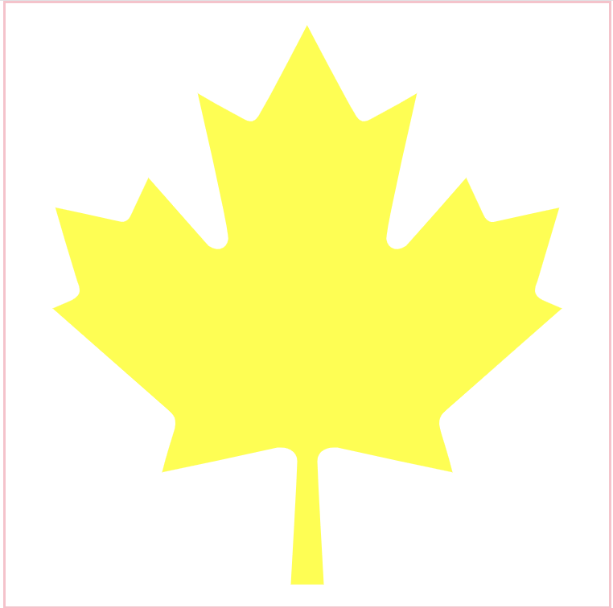

# [에이블런] [프론트엔드부트캠프] 2주차 2차시 TIL

## 학습 내용 요약
이번에는 반응형 웹 디자인과 관련된 다양한 기술을 배웠다. <br>
특히, 미디어 쿼리를 활용한 반응형 디자인, Flexbox를 활용한 레이아웃 구성, SVG를 이용한 벡터 그래픽 삽입 및 스타일링, 그리고 Flex 레이아웃을 활용한 다양한 배치 방법을 익혔다. <br>
이 과정에서 발생할 수 있는 에러와 그 해결 방법도 함께 학습했다.


## Media 쿼리
미디어 쿼리는 웹 페이지의 스타일을 다양한 디바이스와 화면 크기에 맞게 조정할 수 있게 해준다. 이를 통해 반응형 웹 디자인을 구현할 수 있다. 다음 예제는 다양한 화면 크기에 대응하는 미디어 쿼리를 포함하고 있다.


### index.html
```html
<!DOCTYPE html>
<html lang="ko">
<head>
    <meta charset="UTF-8">
    <meta name="viewport" content="width=device-width, initial-scale=1.0">
    <title>미디아 쿼리</title>
    <link rel="stylesheet" href="styles.css">
</head>
<body>
    <section>
        <div class="inner">
            <h1>Lorem, ipsum dolor. </h1>
            <div class="wrap">
                <article class="box1"></article>
                <article class="box2"></article>
            </div>
        </div>
    </section>
</body>
</html>
```

### styles.css
```css
@import url(reset.css);

* {
    transition: all 1s;
}

section {
    width: 100%;
    padding: 150px 0;
}

section .inner{
    width: 1180px;
    margin: 0px auto;
}

section .inner h1 {
    font: bold 22px/1 arial;
    color: #555;
    text-align: center;
}

section .inner .wrap{
    display: flex;
    flex-direction: row;
    justify-content: space-between;
}

section .inner .wrap .box1,
section .inner .wrap .box2 {
    width: 48%;
    height: 250px;
    background-color: #bbb;
    margin-top: 10px;
}

@media screen and (max-width:1179px) {
    section{
        padding: 100px 0;
    }    
    section .inner {
        width: 100%;
    }
    section .inner h1{
        margin-bottom: 50px;
    }
    section .inner .wrap .box1,
    section .inner .wrap .box2 {
        width: 48%;
        height: 350px;
        margin-top: 10px;
        margin: 1%;
    }   
}

@media screen and (max-width:768px){
    section{
        padding: 50px 0;
    }
}

@media screen and (max-width:480px) {
    section .inner .wrap .box1,
    section .inner .wrap .box2 {
        width: 80%;
        height: 250px;
        margin: 0 auto;
        margin-top: 10px;
    }   
}
```

## Display Flex
Flexbox 레이아웃은 컨테이너 내의 항목들을 쉽게 정렬하고 배치할 수 있게 해준다. 기본적으로 사용되는 Flexbox 속성은 다음과 같다.


### index.html
```html
<!DOCTYPE html>
<html lang="ko">
<head>
    <meta charset="UTF-8">
    <meta name="viewport" content="width=device-width, initial-scale=1.0">
    <title>Document</title>
    <link rel="stylesheet" href="style.css">
</head>
<body>
    <main>
        <section class="box1">
            <article>1</article>
            <article>2</article>
            <article>3</article>
            <article>4</article>
        </section>
    </main>
    
    <!-- Flex Grow -->
    <section class="box2">
        <article>FLEX GROW</article>
        <article>FLEX GROW</article>
        <article>FLEX GROW</article>
    </section>

    <!-- flex shrink -->
    <section class="box3">
        <article>FLEX SHRINK</article>
        <article>FLEX SHRINK</article>
        <article>FLEX SHRINK</article>
    </section>

    
    <!-- flex -->
    <section class="box4">
        <article>FLEX</article>
        <article>FLEX</article>
        <article>FLEX</article>
    </section>
</body>
</html>
```

### styles.css
```css
@charset 'utf-8';
/*reset*/
*{ margin:0px; padding:0px}
ul,ol,li{ list-style:none; }
a{text-decoration:none; }
/* --------------------------------- */
main {
    width: 100%;
    height: 100vh;
    background: #fff;
}

.box1 {
    width: 100%;
    height: 100%;
    border: 10px solid #000;
    display: flex;
    /* display: inline-flex; */
    /* flex-direction: row; */
    flex-flow: row wrap;
    /* justify-content: flex-start; */
    /* justify-content: flex-end; */
    /* justify-content: center; */
    /* justify-content: space-between; */
    /* justify-content: space-around; */
    justify-content: space-evenly; 
    /* align-items: center; */
    align-content: center;
}

.box1 article {
    width: 100px;
    height: 100px;
    border: 1px solid #000;
}
.box1 article:nth-of-type(1) {
    background-color: hotpink;
    order: 4;
}
.box1 article:nth-of-type(2) {
    background-color: gold;
    order: 3;
}
.box1 article:nth-of-type(3) {
    background-color: skyblue;
    order: 1;
}
.box1 article:nth-of-type(4) {
    background-color: crimson;
    order: 2;
}

/* ---------------------------------------- */


.box2 {
    width: 100%;
    background: pink;
    display: flex;
}

.box2 article{
    border: 1px solid #000;
    box-sizing: border-box;
    background-color: crimson;
    font-size: 50px;
    color: #fff;
}

.box2 article:nth-of-type(1){
    flex-grow: 1;
}
.box2 article:nth-of-type(2){
    flex-grow: 2;
}
.box2 article:nth-of-type(3){
    flex-grow: 1;
}

/* -------------------------------------- */

.box3 {
    width: 100%;
    background: skyblue;
    display: flex;
}

.box3 article{
    width: 400px;
    background-color: hotpink;
    border: 1px solid #000;
    box-sizing: border-box;
    font-size: 50px;
    color: #fff;
}

.box3 article:nth-of-type(1){
    flex-shrink: 1;
}
.box3 article:nth-of-type(2){
    flex-shrink: 2;
}
.box3 article:nth-of-type(3){
    flex-shrink: 3;
}

/* --------------------------------------- */

.box4 {
    width: 100%;
    background: crimson;
    display: flex;
}

.box4 article{
    width: 400px;
    background-color: gold;
    border: 1px solid #000;
    box-sizing: border-box;
    font-size: 50px;
    color: #fff;
}

.box4 article:nth-of-type(1){
    flex: 1;
}
.box4 article:nth-of-type(2){
    flex: 2;
}
.box4 article:nth-of-type(3){
    flex: 3;
}
```

## SVG
SVG(Scalable Vector Graphics)는 XML 형식의 2D 벡터 이미지를 나타내는 파일 형식이다. 웹에서 그래픽을 표현할 때 자주 사용된다. 다음은 SVG를 활용한 예제 코드이다.



### index.html
```html
<!DOCTYPE html>
<html lang="ko">
<head>
    <meta charset="UTF-8">
    <meta name="viewport" content="width=device-width, initial-scale=1.0">
    <title>SVG</title>
    <link rel="stylesheet" href="styles.css">
</head>
<body>
    <article>
        <svg xmlns="http://www.w3.org/2000/svg" viewBox="-20 -20 552 552"><path d="M383.8 351.7c2.5-2.5 105.2-92.4 105.2-92.4l-17.5-7.5c-10-4.9-7.4-11.5-5-17.4 2.4-7.6 20.1-67.3 20.1-67.3s-47.7 10-57.7 12.5c-7.5 2.4-10-2.5-12.5-7.5s-15-32.4-15-32.4-52.6 59.9-55.1 62.3c-10 7.5-20.1 0-17.6-10 0-10 27.6-129.6 27.6-129.6s-30.1 17.4-40.1 22.4c-7.5 5-12.6 5-17.6-5C293.5 72.3 255.9 0 255.9 0s-37.5 72.3-42.5 79.8c-5 10-10 10-17.6 5-10-5-40.1-22.4-40.1-22.4S183.3 182 183.3 192c2.5 10-7.5 17.5-17.6 10-2.5-2.5-55.1-62.3-55.1-62.3S98.1 167 95.6 172s-5 9.9-12.5 7.5C73 177 25.4 167 25.4 167s17.6 59.7 20.1 67.3c2.4 6 5 12.5-5 17.4L23 259.3s102.6 89.9 105.2 92.4c5.1 5 10 7.5 5.1 22.5-5.1 15-10.1 35.1-10.1 35.1s95.2-20.1 105.3-22.6c8.7-.9 18.3 2.5 18.3 12.5S241 512 241 512h30s-5.8-102.7-5.8-112.8 9.5-13.4 18.4-12.5c10 2.5 105.2 22.6 105.2 22.6s-5-20.1-10-35.1 0-17.5 5-22.5z"/></svg>
    </article>
    
</body>
</html>
```

### styles.css
```css
@charset 'utf-8';
/*reset*/
*{ margin:0px; padding:0px}
ul,ol,li{ list-style:none; }
a{text-decoration:none; }

/* ---------------------------------- */

article

 {
    width: 500px;
    height: 500px;
    margin: 0 auto;
    border: 2px solid pink;
}

article path{
    transition: all 1s;
    fill: yellow;
    stroke: #000;
    stroke-width: 5;
    stroke-dasharray: 2173;
    stroke-dashoffset: 2173;
}

article path:hover{
    fill: gold;
    stroke: #000;
    stroke-width: 5;
    stroke-dasharray: 15;
    stroke-dashoffset: 0;
}

img {
    width: 200px; 
    height: 200px;
}
```

## Flex Layout
Flex 레이아웃을 이용해 요소들을 배치할 때, 각 속성을 적절히 사용하는 것이 중요하다. 다음은 Flex 레이아웃을 활용한 예제 코드이다.


### index.html
```html
<!DOCTYPE html>
<html lang="ko">
<head>
    <meta charset="UTF-8">
    <meta name="viewport" content="width=device-width, initial-scale=1.0">
    <title>Document</title>
    <link rel="stylesheet" href="styles.css">
</head>
<body>  
    <video src="vids/vid4.mp4" muted autoplay loop></video>
    <main>
        <h1>Bocchi The Rock</h1>
        <section>
            <article>
                <h2>Hitori Gotoh</h2>
                <div class="txt">
                    <p>"저, 저는··· 기타리스트로서 모두의 소중한 결속 밴드를 최고의 밴드로 만들고 싶어요."</p>
                    <span>2024.07.23</span>
                </div>
                <div class="pic">
                    
                </div>
            </article>
            <article>
                <h2>Nijika Ijichi</h2>
                <div class="txt">
                    <p>"하여간 난 확신했어! 봇치가 있으면 꿈을 이룰 수 있다고! 그러니까 앞으로도 많이 보여줘. 봇치의 록··· 봇치 더 록을!"</p>
                    <span>2024.07.23</span>
                </div>
                <div class="pic">
                         
                </div>
            </article>
            <article>
                <h2>Ryo Yamada</h2>
                <div class="txt">
                    <p>"따로따로 노는 개성이 한 데 모여서 하나의 음악이 되고 그게 결속 밴드의 특색이 되는 거잖아."</p>
                    <span>2024.07.23</span>
                </div>
                <div class="pic">
                    
                </div>
            </article>
            <article>
                <h2>Ikuyo Kita</h2>
                <div class="txt">
                    <p>"모두에게 보여줘, 사실 고토씨는 엄청나게 멋지단 걸!"</p>
                    <span>2024.07.23</span>
                </div>
                <div class="pic">
                    
                </div>
            </article>
        </section>
    </main>
</body>
</html>
```

### reset.css
```css
@charset 'utf-8';
/*reset*/
*{ margin:0px; padding:0px}
ul,ol,li{ list-style:none; }
a{text-decoration:none; }
```

### styles.css
```css
@import url(reset.css);
@import url('https://fonts.googleapis.com/css2?family=Nanum+Myeongjo&family=Noto+Sans+KR:wght@100..900&display=swap');
@import url('https://fonts.googleapis.com/css2?family=Kalnia+Glaze:wght@100..700&display=swap');

* {
    color: #fff;
    transition: all 0.5s;
}

:root{
    --fontTit:'Nanum Myeongjo';
}

body{
    background: #111;
}

main {
    width: 70vw;
    margin: 100px auto;
}

video {
    width: 100%;
    background: black;
    position: absolute;
    left: 0;
    top: 0;
    z-index: -1;
    overflow: hidden;
    object-fit: cover;  
    opacity: 0.2;
    box-shadow: 0 80px 200px pink;
}

main h1 {
    font-weight: normal;
    font-size: 100px;
    line-height: 1;
    color: pink;
    margin-bottom: 100px;
    font-family: var(--fontTit);
}
main h1::after {
    content: '';
    display: block;
    width: 100px;
    height: 2px;
    background-color: pink;
    margin-top: 20px;
}

main section {
    width: 100%;
    margin: 0 auto;
}

main section article {
    display: flex;
    justify-content: space-between;
    flex-wrap: wrap;
    border-bottom: 2px solid #ccc;
    padding: 30px 0;
}
main section article:nth-of-type(even) { /* 짝수번째 배열 reverse */
    flex-direction: row-reverse;
}

main section article h2 {
    width: 30%;
    font: normal 36px/1.2 'Nanum Myeongjo';
}

main section .txt {
    width: 35%;
    display: flex;
    position: relative;
    flex-wrap: wrap;
    align-content: space-between;
    font: normal 16/1 'Noto Sans KR';
    opacity: 0.7;
}
main section .txt p{
    color: #fff;
}
main section .txt span{
    color: gold;
}

main section .pic{
    width: 33%;
    height: 200px;
}

main section article:nth-of-type(1) .pic{
    background-color: pink;
    box-shadow: 0 0 20px pink;
}
main section article:nth-of-type(2) .pic{
    background-color: gold;
    box-shadow: 0 0 20px gold;
}
main section article:nth-of-type(3) .pic{
    background-color: skyblue;
    box-shadow: 0 0 20px skyblue;
}
main section article:nth-of-type(4) .pic{
    background-color: crimson;
    box-shadow: 0 0 20px crimson;
}
main section .pic img{
    width: 100%;
    height: 100%;
    object-fit: contain;
}

@media screen and (max-width:1222px) {
    main {
        width: 80vw;
    }
    main h1{
        color: gold;
    }
    main h1::after {
        content: '';
        display: block;
        width: 100px;
        height: 2px;
        background-color: gold;
        margin-top: 20px;
    }
    video {
        box-shadow: 0 80px 200px gold;
    }
}

@media screen and (max-width:779px) {
    main h1 {
        font-size: 80px;
        color: skyblue;
    }
    main h1::after {
        background-color: skyblue;
    }

    main section article h2{
        width: 48%;
    }

    main section .txt{
        width: 48%;
    }
    main section p{
        margin-bottom: 20px;
    }

    main section .pic{
        width: 100%;
        height: 30vh;
        margin-top: 40px;
    }
    video {
        box-shadow: 0 80px 200px skyblue;
    }
}

@media screen and (max-width:539px) {
    main h1 {
        font-size: 80px;
        color: crimson;
    }
    main h1::after {
        background-color: crimson;
    }

    main section article h2{
        width: 100%;
        margin-bottom: 20px;
    }

    main section .txt{
        width: 100%;
    }
    main section p{
        margin-bottom: 20px;
    }

    main section .pic{
        width: 100%;
        height: 30vh;
        margin-top: 40px;
    }
    video {
        box-shadow: 0 80px 200px crimson;
    }
}
```

### 에러 발생 및 해결 방법
1. **에러 발생 이유**: `flex-direction` 속성을 사용했을 때 방향이 의도한 대로 설정되지 않는 경우가 있었다.  
   **해결 방법**: `flex-direction` 속성을 `row` 대신 `column`으로 설정하여 세로 방향으로 정렬되도록 수정했다.

```css
.container {
  display: flex;
  flex-direction: column;
}
```

2. **에러 발생 이유**: `justify-content` 속성을 적용했을 때 자식 요소들이 원하는 대로 정렬되지 않는 경우가 있었다.  
   **해결 방법**: `justify-content` 속성 값을 `space-around`에서 `space-between`으로 변경하여 자식 요소들이 균

등하게 분배되도록 수정했다.

```css
.container {
  display: flex;
  justify-content: space-between;
}
```

#### 여담

왜인지 이번주부터 집에만 가면 ~~뒤~~..사망할것 같다. <br>
다음주가 될때쯤엔 헬스장도 못가서 다시 개멸치가 될것같다. (현 진행중) <br>
~~그리고 아침에 일어날때 현타가 왜이렇게 씨게 오는건지 스트레스 받아서 죽겠다.~~

### 해시태그
#프론트엔드 #프론트엔드개발 #프론트엔드부트캠프 #프론트엔드교육 #프론트엔드국비지원 #웹개발부트캠프 #웹개발교육 #웹개발국비지원 #에이블런부트캠프
