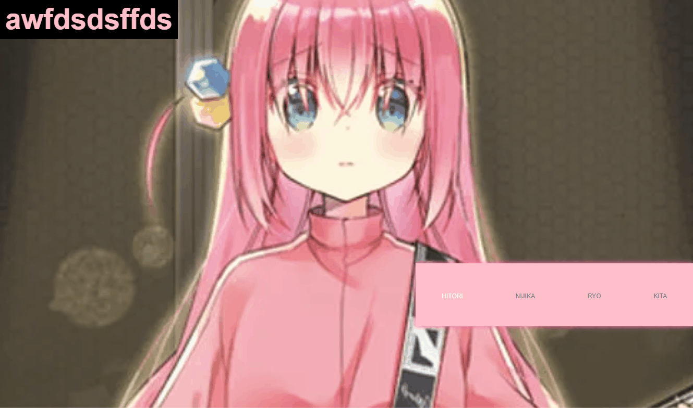

# [에이블런] [프론트엔드부트캠프] 3주차 1차시 TIL

## Full-Screen Gallery

#### HTML 및 CSS 설정

이번 학습에서는 전체 화면 갤러리를 만드는 방법을 배웠다. 주요 구성 요소는 이미지 갤러리와 갤러리 항목을 클릭했을 때 이미지와 텍스트가 동적으로 변경되는 기능이다.



### HTML

```html
<!DOCTYPE html>
<html lang="en">
<head>
    <meta charset="UTF-8">
    <meta name="viewport" content="width=device-width, initial-scale=1.0">
    <title>Document</title>
    <link rel="stylesheet" href="style.css">
    <script src="script.js" defer></script>
</head>
<body>
    <section id="gallery">
        <h1 id="tb" class="hitori">awfdsdsffds</h1>
        <article class="showBox">
            
        </article>
        
        <nav class="controls">
            <ul class="btns">
                <li class="on">
                    <a href="img/pic1.png" >HITORI</a>
                </li>
                <li>
                    <a href="img/pic2.png">NIJIKA</a>
                </li>
                <li>
                    <a href="img/pic3.png">RYO</a>
                </li>
                <li>
                    <a href="img/pic4.png">KITA</a>
                </li>
            </ul>
        </nav>
    </section>
</body>
</html>
```

### CSS

```css
@charset 'utf-8';
/*reset*/
*{ margin:0px; padding:0px; transition: all 1s;}
ul,ol,li{ list-style:none; }
a{text-decoration:none;}

#gallery {
    width: 100%;
    height: 100vh;
    background-color: #000;
}

#gallery h1 {
    position: absolute;
    display: block;
    z-index: 1;
    font: bold 55px/1 arial;
    color: #fff;
    background-color: #000;
    padding: 10px;
}
#gallery h1.hitori{
    color: pink;
}
#gallery h1.nijika{
    color: gold;
}
#gallery h1.ryo{
    color: skyblue;
}
#gallery h1.kita{
    color: crimson;
}

#gallery .showBox {
    width: 100%;
    height: 100%;
    position: absolute;
    top: 0;
    left: 0;
    overflow: hidden;
}

#gallery .showBox img {
    width: 100%;
    height: 100%;
    object-fit: cover;
}

#gallery .controls {
    width: 40%;
    padding: 50px;
    box-sizing: border-box;
    background-color: pink;
    box-shadow: 0 0 10px hotpink;
    position: absolute;
    right: 0;
    bottom: 20vh;
}

#gallery .controls ul {
    display: flex;
    justify-content: space-between;
}

#gallery .controls ul li a{
    font: normal 12px/1 arial;
    color: #777;
}
#gallery .controls ul li.on a{
    color: #fff;
}

#gallery .controls ul li:hover a {
    color: #fff;
}
```

### JS 구현 및 출력 결과

각 이미지의 썸네일을 클릭하면 큰 이미지와 텍스트가 변경되며, 각 항목에 대한 하이라이트도 변경된다.

```javascript
const btns = document.querySelectorAll('.btns li');
const bgImg = document.querySelector(".showBox img");

console.log(btns[0].querySelector('a').textContent);

for (let i=0; i<btns.length; i++) {
    btns[i].addEventListener('click', (e) => {
        e.preventDefault();
        
        bgImg.setAttribute("src", `img/bPic${i+1}.png`);
        
        for (const bt of btns) {
            bt.classList.remove("on");
        }
        
        const textH1 = document.querySelector('h1');
        textH1.className = ''
        switch (btns[i].querySelector('a').textContent) {
            case "HITORI":
                textH1.textContent = "Hitori Gotoh";
                textH1.classList.add('hitori');
                break;
            case "NIJIKA":
                textH1.textContent = "Nijika Ijichi";
                textH1.classList.add('nijika'); 
                break;
            case "RYO":
                textH1.textContent = "Ryo Yamada";
                textH1.classList.add('ryo');
                break;
            case "KITA":
                textH1.textContent = "Ikuyo Kita";
                textH1.classList.add('kita');
                break;
            default:
                break;
        }

        activation(btns[i], btns);
    });
}

function activation(item, items){
    for (const tem of items) {
        tem.classList.remove("on");
    }
    item.classList.add("on");
}
```
```plaintext
Hitori Gotoh
Nijika Ijichi
Ryo Yamada
Ikuyo Kita
```

## SCSS 기본문법

SCSS(Syntactically Awesome Stylesheets)는 CSS의 확장판으로, 코드의 가독성과 재사용성을 높이기 위해 다양한 기능을 제공합니다. 이번 학습에서는 Sass의 기본 문법과 활용 방법을 배웠습니다.

### SCSS 설치 및 기본 사용법

#### 설치 방법

1. **Node.js 설치**
   - Node.js는 Sass를 실행하는 데 필요한 환경입니다.
   - [Node.js 공식 웹사이트](https://nodejs.org/)에서 설치할 수 있습니다.

2. **SCSS 설치**
   - 터미널에서 다음 명령어를 입력하여 Sass를 전역 설치합니다.
   ```
   npm install -g sass
   ```
   - 설치 확인:
   ```
   sass --version
   ```

##### SCSS 사용 예시

1. **변수 사용**

   변수는 반복 사용되는 값을 저장하고 재사용할 수 있도록 합니다.

   ```scss
   $primary-color: #333;
   $padding: 20px;

   body {
     font-family: Arial, sans-serif;
     color: $primary-color;
     padding: $padding;
   }
   ```

2. **중첩 (Nesting)**

   중첩은 CSS 선택자를 계층 구조로 표현하여 코드의 가독성을 높입니다.

   ```scss
   nav {
     ul {
       margin: 0;
       padding: 0;
       list-style: none;
     }

     li { 
       display: inline-block; 
     }

     a {
       display: block;
       padding: 6px 12px;
       text-decoration: none;
     }
   }
   ```

3. **Mixin**

   Mixin은 여러 곳에서 반복적으로 사용되는 스타일을 재사용할 수 있도록 도와줍니다.

   ```scss
   @mixin border-radius($radius) {
     -webkit-border-radius: $radius;
        -moz-border-radius: $radius;
             border-radius: $radius;
   }

   .box { 
     @include border-radius(10px); 
   }
   ```

4. **연산자**

   Sass에서는 CSS와 달리 연산자를 사용하여 값을 계산할 수 있습니다.

   ```scss
   .container {
     width: 100% - 20px;
     height: (500px / 2);
   }
   ```

5. **조건문**

   조건문을 사용하여 상황에 따라 다른 스타일을 적용할 수 있습니다.

   ```scss
   @if $primary-color == #333 {
     body {
       background-color: #000;
     }
   } @else {
     body {
       background-color: #fff;
     }
   }
   ```

6. **반복문**

   반복문을 사용하여 여러 요소에 대해 반복적으로 스타일을 적용할 수 있습니다.

   ```scss
   @for $i from 1 through 3 {
     .item-#{$i} { width: 2em * $i; }
   }
   ```

### 예제

각 article이 다른 시간 지연을 두어 순차적으로 나타나게 되는 코드를 scss로 구현함


### HTML

```html
<!DOCTYPE html>
<html lang="ko">
<head>
    <meta charset="UTF-8">
    <meta name="viewport" content="width=device-width, initial-scale=1.0">
    <title>Document</title>
    <link rel="stylesheet" href="css/style.css">
</head>
<body>
    <section>
        <div class="inner">
            <h1>로람 뭐시깽이</h1>
            <div class="wrap">
                <article>
                    <a href="#">button</a>
                </article>
                <article></article>
                <article></article>
                <article></article>
                <article></article>
                <article></article>
                <article></article>
                <article></article>
                <article></article>
                <article></article>
            </div>
        </div>
    </section>
</body>
</html>
```

### SCSS
```scss
@charset 'utf-8';
@import 'reset.scss';

$bg : #efefef;
$wid : 1180px;

@mixin button($wd : 200px, $ht : 150px, $btnBg : #fff, $rds : 25px){
    display: block;
    width: $wd;
    height: $ht;
    border-radius: $rds;
    font-size: 12px;
    line-height: 50px;
    text-align: center;
    background-color: $btnBg;

}


/* section */

section{
    width: 100%;
    padding: 180px 0;
    background: $bg;
    
    .inner{
        width: $wid;
        margin: 0 auto;

        h1{
            font: border 22px/1 arial;
            color: #555;
            text-align: center;
        }
        
        .wrap{
            display: flex;
            gap: 20px;
            flex-wrap: wrap;

            article{
                width:($wid / 4);
                height: 200px;
                background-color: #000;
                transform: translateY(100%);
                opacity: 0;
                transition: all 1s;
                    
                a{
                    @include button(200px, 50px, pink, 15px);
                }

                @for $i from 1 through 10 {
                    &:nth-of-type(#{$i}){
                        transition-delay: $i*0.3s;
                    }
                }
            }
        }
    }

    &:hover .inner .wrap article{
        transform: translateY(0%);
        opacity: 1;
    }
}
```

### SCSS 컴파일

```css
/*reset*/
* {
  margin: 0px;
  padding: 0px;
}

ul, ol, li {
  list-style: none;
}

a {
  text-decoration: none;
}

/* section */
section {
  width: 100%;
  padding: 180px 0;
  background: #efefef;
}
section .inner {
  width: 1180px;
  margin: 0 auto;
}
section .inner h1 {
  font: border 22px/1 arial;
  color: #555;
  text-align: center;
}
section .inner .wrap {
  display: flex;
  gap: 20px;
  flex-wrap: wrap;
}
section .inner .wrap article {
  width: 295px;
  height: 200px;
  background-color: #000;
  transform: translateY(100%);
  opacity: 0;
  transition: all 1s;
}
section .inner .wrap article a {
  display: block;
  width: 200px;
  height: 50px;
  border-radius: 15px;
  font-size: 12px;
  line-height: 50px;
  text-align: center;
  background-color: pink;
}
section .inner .wrap article:nth-of-type(1) {
  transition-delay: 0.3s;
}
section .inner .wrap article:nth-of-type(2) {
  transition-delay: 0.6s;
}
section .inner .wrap article:nth-of-type(3) {
  transition-delay: 0.9s;
}
section .inner .wrap article:nth-of-type(4) {
  transition-delay: 1.2s;
}
section .inner .wrap article:nth-of-type(5) {
  transition-delay: 1.5s;
}
section .inner .wrap article:nth-of-type(6) {
  transition-delay: 1.8s;
}
section .inner .wrap article:nth-of-type(7) {
  transition-delay: 2.1s;
}
section .inner .wrap article:nth-of-type(8) {
  transition-delay: 2.4s;
}
section .inner .wrap article:nth-of-type(9) {
  transition-delay: 2.7s;
}
section .inner .wrap article:nth-of-type(10) {
  transition-delay: 3s;
}
section:hover .inner .wrap article {
  transform: translateY(0%);
  opacity: 1;
}

/*# sourceMappingURL=style.css.map */
```

## Video Flex Layout

이번 학습에서는 이전에 Flexbox를 활용한 비디오 레이아웃을 보완했다. 사용자 인터랙션에 따라 비디오가 재생되고 정지되는 기능을 구현했다.


### HTML

```html
<!DOCTYPE html>
<html lang="ko">
<head>
    <meta charset="UTF-8">
    <meta name="viewport" content="width=device-width, initial-scale=1.0">
    <title>video flex layout</title>
    <link rel="stylesheet" href="css/style.css">
    <link rel="stylesheet" href="https://cdnjs.cloudflare.com/ajax/libs/font-awesome/6.6.0/css/all.min.css" integrity="sha512-Kc323vGBEqzTmouAECnVceyQqyqdsSiqLQISBL29aUW4U/M7pSPA/gEUZQqv1cwx4OnYxTxve5UMg5GT6L4JJg==" crossorigin="anonymous" referrerpolicy="no-referrer" />
    <script src="script.js" defer></script>
</head>
<body>
    <main>
        <header>
            <h1>
                <i class="fab fa-firstdraft"></i><br>
                <span>Bocchi <br>The <br>Rock</span>
            </h1>

            <address>
                2024 DRAFT <br>
                ALL RIGHT RESREVED.
            </address>
        </header>
        <nav>
            <ul>
                <li>
                    <a href="#">
                        <i class="far fa-envelope"></i>
                    </a>
                </li>
                <li>
                    <a href="#">
                        <i class="fas fa-search"></i>
                    </a>
                </li>
            </ul>
        </nav>
        <!-- ------------------------------------- -->
        <

section>
            <!-- ----------------------------------- -->
            <article>
                <div class="inner">
                    <div class="txt">
                        <h2>01</h2>
                        <p>Lorem ipsum dolor sit amet, consectetur adipisicing elit. Repudiandae, cumque!</p>
                    </div>
                    <figure>
                        <video src="vids/vid1.mp4" loop></video>
                    </figure>
                </div>
            </article>
            <!-- ----------------------------------- -->
            <article>
                <div class="inner">
                    <div class="txt">
                        <h2>02</h2>
                        <p>Lorem ipsum dolor sit amet, consectetur adipisicing elit. Repudiandae, cumque!</p>
                    </div>
                    <figure>
                        <video src="vids/vid2.mp4" loop></video>
                    </figure>
                </div>
            </article>
            <!-- ----------------------------------- -->
            <article>
                <div class="inner">
                    <div class="txt">
                        <h2>03</h2>
                        <p>Lorem ipsum dolor sit amet, consectetur adipisicing elit. Repudiandae, cumque!</p>
                    </div>
                    <figure>
                        <video src="vids/vid3.mp4" loop></video>
                    </figure>
                </div>
            </article>
            <!-- ----------------------------------- -->
            <article>
                <div class="inner">
                    <div class="txt">
                        <h2>04</h2>
                        <p>Lorem ipsum dolor sit amet, consectetur adipisicing elit. Repudiandae, cumque!</p>
                    </div>
                    <figure>
                        <video src="vids/vid4.mp4" loop></video>
                    </figure>
                </div>
            </article>
        </section>
    </main>
    <aside>
        <div class="txt">
            <h2>01</h2>
            <p>Lorem ipsum dolor sit amet consectetur, adipisicing elit. Explicabo, facilis?</p>
            <span>Close</span>
        </div>
        <figure>
            <video src="bocchiTheRock-AMV" autoplay loop></video>
        </figure>
    </aside>
</body>
</html>
```

### SCSS

```scss
@import 'reset';
@import url('https://fonts.googleapis.com/css2?family=Alegreya+Sans+SC:ital,wght@0,100;0,300;0,400;0,500;0,700;0,800;0,900;1,100;1,300;1,400;1,500;1,700;1,800;1,900&display=swap');

main {
    width: 100%;
    height: 100vh;
    background-color: #333;
    display: flex;
    overflow: hidden;

    header {
        width: 20%;
        height: 100%;
        padding: 10vh 5vw;
        display: flex;
        flex-flow: wrap;
        align-content: space-between;
        z-index: 3;

        h1 i {
            font-size: 6vw;
            color: #fff;
        }

        span {
            color: pink;
        }

        address {
            font: normal 11px/1.2 'arial';
            color: #fff;
            opacity: 0.8;
        }
    }

    nav {
        position: absolute;
        top: 10vh;
        right: 5vw;
        z-index: 3;

        ul {
            display: flex;

            li a {
                font-size: 18px;
                color: #fff;
                margin-left: 30px;
            }
        }
    }

    section {
        width: 80%;
        height: 100%;
        padding: 5vh;
        display: flex;

        article {
            position: relative;
            flex: 1;
            padding: 70px 25px 100px;
            transition: flex 0.5s, opacity 0.5s;
            z-index: 1;

            &:hover {
                flex: 1.5;
                opacity: 1;
                z-index: 2;

                .txt h2 {
                    font-size: 5vw;
                    padding-top: 0;
                }

                .txt h2::after {
                    width: 100px;
                    height: 1px;
                    margin-bottom: 6vh;
                }

                figure {
                    filter: saturate(100%);
                    height: 25vh;
                    transform: translateY(3vh);
                }
            }

            &::before {
                content: '';
                display: block;
                width: 80%;
                height: 95%;
                position: absolute;
                top: 0;
                left: -200px;
                opacity: 0;
                background-color: #444;
                z-index: -1;
                transition: 0.5s;
            }

            &:hover::before {
                width: 90%;
                left: 0;
                opacity: 1;
                z-index: 0;
            }

            .inner {
                width: 100%;
                height: 100%;
                display: flex;
                flex-wrap: wrap;
                position: relative;

                .txt {
                    width: 100%;

                    h2 {
                        font: normal 2vw/1 'Alegreya Sans SC';
                        transition: 0.5s;
                        color: #fff;
                        padding-top: 70px;

                        &::after {
                            content: '';
                            display: block;
                            width: 40px;
                            height: 3px;
                            background-color: #777;
                            margin-bottom: 7vh;
                            transition: 0.5s;
                        }
                    }

                    p {
                        font: 14px/1.4 arial;
                        color: #999;
                    }
                }

                figure {
                    width: 100%;
                    height: 20vh;
                    background-color: #777;
                    filter: saturate(10%);
                    overflow: hidden;
                    transition: 0.6s;

                    video {
                        width: 100%;
                        height: 100%;
                        object-fit: cover;
                        transform: scale(1.1);
                        transition: 0.5s;
                    }
                }
            }
        }
    }

    aside {
        width: 100%;
        height: 100vh;
        background-color: #333;
        position: absolute;
        left: 0;
        top: 0;
        opacity: 0;
        display: flex;
        justify-content: space-between;
        padding: 20vh 7vw 14vh 20vw;
        transition: 1s;
        z-index: -1;

        &.on {
            left: 0;
            opacity: 1;
            z-index: 2;
        }

        .txt {
            width: 25%;
            height: 100%;

            h2 {
                font: 100 6vw/1 'Alegreya Sans SC';
                color: #bbb;
                margin-bottom: 20px;
            }

            p {
                font: 1.1vw/1.3 'arial';
            }

            span {
                cursor: pointer;
                color: orange;
            }
        }

        figure {
            width: 100%;
            height: 100%;

            video {
                width: 100%;
                height: 100%;
                object-fit: cover;
            }
        }
    }
}
```

### SCSS 컴파일

```css
@import 'reset';
@import url('https://fonts.googleapis.com/css2?family=Alegreya+Sans+SC:ital,wght@0,100;0,300;0,400;0,500;0,700;0,800;0,900;1,100;1,300;1,400;1,500;1,700;1,800;1,900&display=swap');

main {
  width: 100%;
  height: 100vh;
  background-color: #333;
  display: flex;
  overflow: hidden;
}
main header {
  width: 20%;
  height: 100%;
  padding: 10vh 5vw;
  display: flex;
  flex-flow: wrap;
  align-content: space-between;
  z-index: 3;
}
main header h1 i {
  font-size: 6vw;
  color: #fff;
}
main header span {
  color: pink;
}
main header address {
  font: normal 11px/1.2 'arial';
  color: #fff;
  opacity: 0.8;
}
main nav {
  position: absolute;
  top: 10vh;
  right: 5vw;
  z-index: 3;
}
main nav ul {
  display: flex;
}
main nav ul li a {
  font-size: 18px;
  color: #fff;
  margin-left: 30px;
}
main section {
  width: 80%;
  height: 100%;
  padding: 5vh;
  display: flex;
}
main section article {
  position: relative;
  flex: 1;
  padding: 70px 25px 100px;
  transition: flex 0.5s, opacity 0.5s;
  z-index: 1;
}
main section article:hover {
  flex: 1.5;
  opacity: 1;
  z-index: 2;
}
main section article::before {
  content: '';
  display:

 block;
  width: 80%;
  height: 95%;
  position: absolute;
  top: 0;
  left: -200px;
  opacity: 0;
  background-color: #444;
  z-index: -1;
  transition: 0.5s;
}
main section article:hover::before {
  width: 90%;
  left: 0;
  opacity: 1;
  z-index: 0;
}
main section article .inner {
  width: 100%;
  height: 100%;
  display: flex;
  flex-wrap: wrap;
  position: relative;
}
main section article .inner .txt {
  width: 100%;
}
main section article .inner .txt h2 {
  font: normal 2vw/1 'Alegreya Sans SC';
  transition: 0.5s;
  color: #fff;
  padding-top: 70px;
}
main section article:hover .inner .txt h2 {
  font-size: 5vw;
  padding-top: 0;
}
main section article .inner .txt h2::after {
  content: '';
  display: block;
  width: 40px;
  height: 3px;
  background-color: #777;
  margin-bottom: 7vh;
  transition: 0.5s;
}
main section article:hover .inner .txt h2::after {
  width: 100px;
  height: 1px;
  margin-bottom: 6vh;
}
main section article .inner .txt p {
  font: 14px/1.4 arial;
  color: #999;
}
main section article .inner figure {
  width: 100%;
  height: 20vh;
  background-color: #777;
  filter: saturate(10%);
  overflow: hidden;
  transition: 0.6s;
}
main section article:hover .inner figure {
  filter: saturate(100%);
  height: 25vh;
  transform: translateY(3vh);
}
main section article .inner figure video {
  width: 100%;
  height: 100%;
  object-fit: cover;
  transform: scale(1.1);
  transition: 0.5s;
}
aside {
  width: 100%;
  height: 100vh;
  background-color: #333;
  position: absolute;
  left: 0;
  top: 0;
  opacity: 0;
  display: flex;
  justify-content: space-between;
  padding: 20vh 7vw 14vh 20vw;
  transition: 1s;
  z-index: -1;
}
aside.on {
  left: 0;
  opacity: 1;
  z-index: 2;
}
aside .txt {
  width: 25%;
  height: 100%;
}
aside .txt h2 {
  font: 100 6vw/1 'Alegreya Sans SC';
  color: #bbb;
  margin-bottom: 20px;
}
aside .txt p {
  font: 1.1vw/1.3 'arial';
}
aside .txt span {
  cursor: pointer;
  color: orange;
}
aside figure {
  width: 100%;
  height: 100%;
}
aside figure video {
  width: 100%;
  height: 100%;
  object-fit: cover;
}
```

### JS
```javascript
const items = document.querySelectorAll("article");

console.log(items)

for(let el of items){
    el.addEventListener("mouseenter", ()=>{
        let video = el.querySelector("figure video");
        console.log(video); // 비디오 요소가 제대로 선택되는지 확인
        if (video) video.play();
    });
    
    el.addEventListener("mouseleave", ()=>{
        let video = el.querySelector("figure video");
        if (video) video.pause();
    });
}
```
```plaintext
NodeList(4) [article, article, article, article]
<video src="vids/vid1.mp4" loop></video>
<video src="vids/vid2.mp4" loop></video>
<video src="vids/vid3.mp4" loop></video>
<video src="vids/vid4.mp4" loop></video>
```

#### 여담

sass는 매우 편리하다.

### 해시태그
#프론트엔드 #프론트엔드개발 #프론트엔드부트캠프 #프론트엔드교육 #프론트엔드국비지원 #웹개발부트캠프 #웹개발교육 #웹개발국비지원 #에이블런부트캠프
