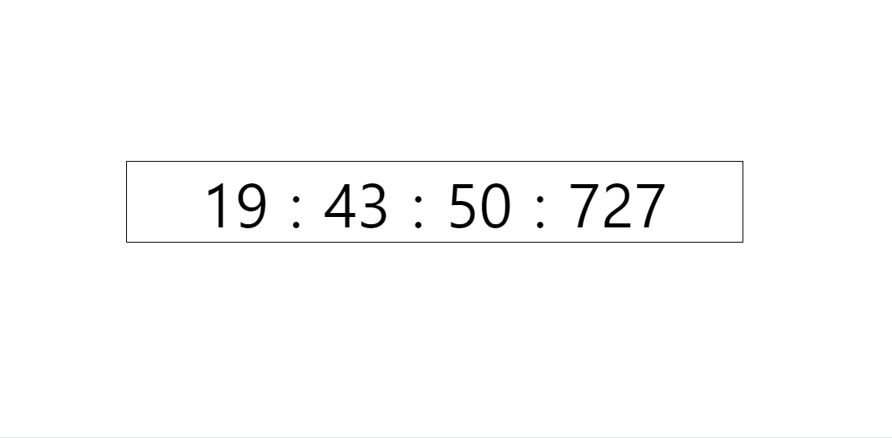

# [에이블런] [프론트엔드부트캠프] 3주차 3차시 TIL

## click event

### 내용
이번 차시에서는 클릭 이벤트에 대해 배웠다. 클릭 이벤트는 사용자가 웹 페이지에서 요소를 클릭할 때 발생하는 이벤트다. 이를 통해 다양한 사용자 인터랙션을 구현할 수 있다. 클릭 이벤트를 다루기 위해 주로 `addEventListener` 메서드를 사용한다.

### 코드
다음은 클릭 이벤트를 활용한 예제 코드다:

```html
<!-- index.html -->
<!DOCTYPE html>
<html lang="en">
<head>
    <meta charset="UTF-8">
    <meta name="viewport" content="width=device-width, initial-scale=1.0">
    <title>Document</title>
    <link rel="stylesheet" href="css/style.css">
    <script src="script.js" defer></script>
</head>
<body>
    <button onclick="clickBtn()">Click me</button>
    <button id="btn">asdf</button>
    <section>
        <article>
            <p>click!!</p>
        </article>
    </section>
</body> 
</html>
```

```css
/* style.css */
/*reset*/
* {
  margin: 0px;
  padding: 0px;
  transition: all 0.5s;
}

ul, ol, li {
  list-style: none;
}

a {
  text-decoration: none;
}

section {
  width: 500px;
  height: 500px;
  background-color: pink;
}

section article {
  width: 300px;
  height: 300px;
  background-color: gold;
}

section article p {
  width: 200px;
  height: 200px;
  background-color: skyblue;
  color: crimson;
}
```

```javascript
// script.js
function clickBtn() {
    console.log("Button Clicked!!");
}

const btn = document.querySelector('#btn');

btn.onclick = () => {
    console.log('1');
};

btn.onclick = () => {
    console.log('2');
};

btn.onclick = () => {
    console.log('3');
};

btn.addEventListener("click", () => {
    console.log("cl1");
});

btn.addEventListener("click", () => {
    console.log("cl2");
});

const section = document.querySelector('section');
const article = document.querySelector('article');
const p = document.querySelector('p');

p.addEventListener('click', (e) => {
    console.log(e);
    console.log(e.target);
    console.log(e.currentTarget);
});

plus();

function plus() {
    console.log(1 + 1);
}

const minus = function() {
    console.log(1 + 1);
};

minus();
```

### 출력 결과
```plaintext
Button Clicked!!
3
cl1
cl2
MouseEvent {...}
<p>...</p>
<p>...</p>
2
2
```

### 에러 발생 및 해결 방법
- **에러 발생 상황**: 클릭 이벤트가 제대로 동작하지 않을 때.
- **해결 방법**: 
  1. 버튼의 ID가 잘못 지정된 경우, HTML 파일에서 버튼의 ID를 확인한다.
  2. `addEventListener` 메서드가 제대로 호출되지 않은 경우, 자바스크립트 파일에서 메서드 호출 부분을 확인한다.

```javascript
// 수정된 script.js
function clickBtn() {
    console.log("Button Clicked!!");
}

const btn = document.querySelector('#btn');

btn.addEventListener("click", () => {
    console.log('Button was clicked!');
    console.log("cl1");
    console.log("cl2");
});

const section = document.querySelector('section');
const article = document.querySelector('article');
const p = document.querySelector('p');

p.addEventListener('click', (e) => {
    console.log(e);
    console.log(e.target);
    console.log(e.currentTarget);
});

plus();

function plus() {
    console.log(1 + 1);
}

const minus = function() {
    console.log(1 + 1);
};

minus();
```

## Date

### 내용
이번 차시에서는 자바스크립트의 Date 객체에 대해 배웠다. Date 객체는 날짜와 시간을 처리하는 데 사용된다. 다양한 메서드를 통해 현재 시간, 특정 날짜, 시간의 계산 등을 수행할 수 있다.

### 예제 코드
다음은 Date 객체를 활용한 예제 코드다:



#### html
```html
<!DOCTYPE html>
<html lang="ko">
<head>
<meta charset="UTF-8">
<meta name="viewport" content="width=device-width, initial-scale=1.0">
 <title>시간관련메소드</title>
<link rel="stylesheet" href="style.css">
<script src="script.js" defer></script>
</head>
<body>
    <p>
        <span class="hours"></span>
        :
        <span class="minutes"></span>
        :
        <span class="seconds"></span>
        :
        <span class="millisecond"></span>
    </p>
</body>
</html>
```

#### css
```css
@charset 'utf-8';
/*reset*/
*{ margin:0px; padding:0px}
ul,ol,li{ list-style:none; }
a{text-decoration:none; }

p{   
    display: block; 
    margin: 20vh auto;
    text-align: center;
    width: 60%;
    border: 1px solid #000;
    font-size:50px; 
    gap:20px; 
}
```

#### js
```javascript
/*
날짜 관련 메소드  
Date() 객체 

//new 를 붙여서 복사하여 호출 
const now = new Date(); 
console.log(now);

const days = ['Sunday', 'Monday', 'Tuesday', 'Wendesday', 'Thursday', 'Friday', 'Saterday']; 

//연도 
console.log(now.getFullYear()); 

//월 0~11 
console.log(now.getMonth() + 1); 

//일
console.log(now.getDate()); //31

//요일 0~6 
console.log(days[now.getDay()]); //3 수요일 

//시간 
console.log(now.getHours());  //13

//분
console.log(now.getMinutes()); //29 

//초 
console.log(now.getSeconds()); //24
*/

const hours = document.querySelector(".hours"); 
const min = document.querySelector(".minutes"); 
const sec = document.querySelector(".seconds"); 
const millisecond = document.querySelector(".millisecond"); 

setInterval(() => {
    let now = new Date(); 

      hours.innerText = now.getHours();
      min.innerText = now.getMinutes(); 
      sec.innerText = now.getSeconds(); 
      millisecond.innerText = now.getMilliseconds(); 
}, 1);

/*
//정해진시간마다 안쪽의 코드 실행 
setInterval(() => {
    //실행코드 
}, 반복시간)

//delay시간 후에 안쪽의 코드 실행 
setTimeout(() => {
    //실행코드 
}, delay)
*/

console.log("1");
setTimeout(() => {
    console.log('2'); 
}, 3000); 
console.log('3');
```

### 출력 결과
```plaintext
1
3
2
```

#### 여담
요즘들어 TIL에 쓸게없다.<br>
TIL쓸 내용을 고민하는데 뇌가 저릿저릿하다.<br>
특히 여담쓸게 없다.

### 해시태그
#프론트엔드 #프론트엔드개발 #프론트엔드부트캠프 #프론트엔드교육 #프론트엔드국비지원 #웹개발부트캠프 #웹개발교육 #웹개발국비지원 #에이블런부트캠프
