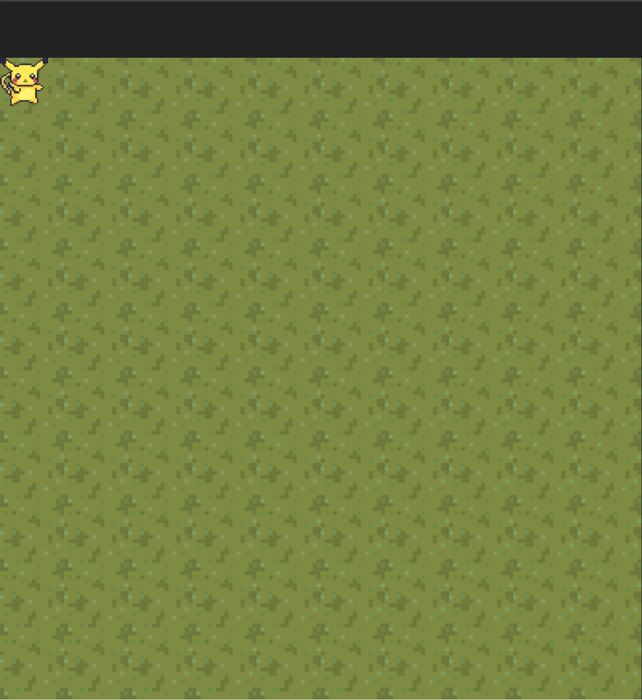

# 7주차 WIL - [에이블런] [프론트엔드부트캠프]

이번 주차에서는 JavaScript의 기초와 중급 문법에 대해 학습하였다. 이를 통해 JavaScript의 기본적인 동작 원리부터 더 복잡한 기능들까지 깊이 있게 이해할 수 있었다.

## JavaScript 기초 익히기

### JavaScript란?

-   JavaScript는 웹 페이지를 더욱 동적이고 상호작용 가능하게 만들어 주는 프로그래밍 언어다. 주로 웹 브라우저에서 사용되며, 사용자와의 상호작용, 데이터 처리, 애니메이션 등을 구현할 때 활용된다. 최근에는 브라우저가 아닌 환경에서도 실행 가능해지면서 다양한 용도로 사용되고 있다.

### 기본 문법

-   JavaScript 코드 작성 시 가장 많이 사용하는 방법 중 하나는 콘솔에 값을 출력하는 `console.log()` 함수다. 이를 통해 변수나 함수의 결과값을 쉽게 확인할 수 있다.

```javascript
console.log("Hello, World!");
```

-   주석을 통해 코드에 설명을 추가할 수 있다. 한 줄 주석은 `//`로, 여러 줄 주석은 `/* ... */`로 작성한다.

```javascript
// 이 부분은 한 줄 주석입니다.
/* 이 부분은 
여러 줄 주석입니다. */
```

-   자료형에는 숫자(Number), 문자열(String), 불리언(Boolean), 객체(Object), Undefined, Null 등이 있다. 각 자료형은 다른 방식으로 처리된다.

```javascript
let number = 1; // Number
let text = "Hello"; // String
let isTrue = true; // Boolean
```

### 변수와 연산자

-   `let`과 `const`를 사용해 변수를 선언하며, `=` 연산자를 통해 값을 할당한다. `let`은 재할당이 가능하지만, `const`는 재할당이 불가능하다.

```javascript
let x = 5;
const y = 10;
x = 7; // 가능
y = 15; // 불가능
```

-   산술 연산자, 비교 연산자, 논리 연산자 등을 통해 다양한 연산을 수행할 수 있다.

```javascript
let sum = 2 + 3; // 5
let isEqual = 5 === 3; // false
```

### 함수와 객체

-   함수는 특정 작업을 수행하는 코드 블록으로, `function` 키워드로 선언할 수 있다. 함수는 재사용이 가능하며, 매개변수를 통해 값을 전달받을 수 있다.

```javascript
function greet(name) {
    return "Hello, " + name;
}
console.log(greet("Alice")); // "Hello, Alice"
```

-   객체는 키와 값의 쌍으로 이루어진 컬렉션으로, 데이터를 구조화하여 저장할 때 유용하다.

```javascript
let person = {
    name: "Alice",
    age: 25,
    job: "Developer",
};
console.log(person.name); // "Alice"
```

## JavaScript 중급 문법

### 반복문과 조건문

-   `for` 문은 반복 실행할 코드를 작성할 때 사용되며, `if` 문은 조건에 따라 실행할 코드를 분기할 때 사용된다.

```javascript
for (let i = 0; i < 5; i++) {
    console.log(i); // 0, 1, 2, 3, 4 출력
}

if (age >= 20) {
    console.log("성인입니다.");
} else {
    console.log("미성년자입니다.");
}
```

### 콜백 함수와 배열 메서드

-   콜백 함수는 다른 함수에 인자로 전달되어 실행되는 함수다. 주로 비동기 처리, 이벤트 핸들링, 배열 메서드에서 사용된다.

```javascript
function processName(callback) {
    const name = prompt("이름을 입력하세요.");
    callback(name);
}

processName(function (name) {
    console.log("안녕하세요, " + name + "님!");
});
```

-   배열 메서드는 데이터를 처리하는 데 유용한 도구들로, `forEach()`, `map()`, `filter()` 등을 배웠다.

```javascript
let numbers = [1, 2, 3, 4, 5];
let squares = numbers.map((num) => num * num);
console.log(squares); // [1, 4, 9, 16, 25]
```

### 스프레드 연산자와 구조 분해

-   스프레드 연산자는 배열이나 객체의 요소들을 개별적으로 펼쳐주는 연산자이며, 구조 분해는 배열이나 객체의 속성을 개별 변수로 쉽게 할당할 수 있는 문법이다.

```javascript
let arr1 = [1, 2, 3];
let arr2 = [...arr1, 4, 5];
console.log(arr2); // [1, 2, 3, 4, 5]

let person = { name: "Alice", age: 25 };
let { name, age } = person;
console.log(name); // "Alice"
```

## JavaScript 고급 문법

### DOM 조작

-   **DOM (Document Object Model)**은 HTML 문서의 프로그래밍 인터페이스로, 웹 페이지의 구조를 트리 형태로 표현하여 JavaScript를 통해 동적으로 변경할 수 있게 한다.

    -   **요소 선택**: `document.querySelector`, `document.getElementById` 등을 사용해 HTML 요소를 선택할 수 있다.

        ```javascript
        const element = document.querySelector(".my-element");
        ```

    -   **요소 조작**: 선택한 요소의 속성, 스타일, 내용을 변경할 수 있다.

        ```javascript
        element.textContent = "새로운 내용";
        element.style.color = "blue";
        ```

    -   **이벤트 핸들링**: 요소에 이벤트 리스너를 추가해 사용자의 동작에 반응할 수 있다.

        ```javascript
        element.addEventListener("click", function () {
            alert("요소가 클릭되었습니다!");
        });
        ```

    -   **요소 생성 및 추가**: 새로운 요소를 생성하고 DOM에 추가할 수 있다.
        ```javascript
        const newElement = document.createElement("div");
        newElement.textContent = "새 요소";
        document.body.appendChild(newElement);
        ```

-   **React와 DOM 조작**: React와 같은 현대적인 JavaScript 프레임워크는 직접적인 DOM 조작을 권장하지 않으며, 가상 DOM을 사용해 UI 상태를 관리하고 필요할 때만 실제 DOM을 업데이트한다. 이는 성능 향상과 코드의 복잡성을 줄이는 데 도움이 된다.

### JSON

-   **JSON (JavaScript Object Notation)**은 데이터를 저장하거나 전송할 때 사용하는 형식으로, 사람이 읽고 쓰기 쉽고 기계가 파싱하고 생성하기 쉬운 구조다.

    -   **JSON 형식**: "키-값" 쌍으로 이루어져 있으며, 모든 키는 문자열 형태로 작성된다.

        ```javascript
        const jsonString = '{"name": "Alice", "age": 25, "isStudent": false}';
        ```

    -   **JSON.parse()**: JSON 문자열을 JavaScript 객체로 변환할 때 사용한다.

        ```javascript
        const jsonString = '{"name": "Alice", "age": 25}';
        const user = JSON.parse(jsonString);
        // user는 { name: "Alice", age: 25 }라는 JavaScript 객체가 된다.
        ```

    -   **JSON.strinwebpy()**: JavaScript 객체를 JSON 문자열로 변환할 때 사용한다.

        ```javascript
        const user = { name: "Alice", age: 25 };
        const jsonString = JSON.strinwebpy(user);
        // jsonString은 '{"name": "Alice", "age": 25}'라는 JSON 형식의 문자열이 된다.
        ```

    -   **JSON의 사용 이유**: 서버와 클라이언트 간 데이터 교환, 구성 설정 등에서 널리 사용되며, 현대 웹 개발에서 중요한 역할을 한다.

## 실습 - 계산기 만들어 보기


뭔가 기능이 좀 완전하진 않은데 UI만 그럴싸하면 기능구현은 나중에 알아서 되겠죠뭐.

-   요구사항:

    -   UI 구현
    -   AC, +, = 기능만 구현
    -   숫자 외 기능은 제외

    ### HTML

    ```html
    <!DOCTYPE html>
    <html lang="en">
        <head>
            <meta charset="UTF-8" />
            <meta
                name="viewport"
                content="width=device-width, initial-scale=1.0"
            />
            <title>Document</title>
            <link rel="stylesheet" href="style.css" />
            <script src="scripts.js" defer></script>
        </head>
        <body>
            <h1>계산기</h1>
            <div id="calculator">
                <div class="top-bar">
                    <button class="close"></button>
                    <button class="full-screen"></button>
                    <button class="get-off"></button>
                </div>
                <div class="display">
                    <p class="result">Error</p>
                </div>
                <dev class="buttons">
                    <button class="btn operator topOp" id="AC">AC</button>
                    <button class="btn operator topOp">+/-</button>
                    <button class="btn operator topOp">%</button>
                    <button class="btn operator">÷</button>

                    <button class="btn number">7</button>
                    <button class="btn number">8</button>
                    <button class="btn number">9</button>
                    <button class="btn operator">×</button>

                    <button class="btn number">4</button>
                    <button class="btn number">5</button>
                    <button class="btn number">6</button>
                    <button class="btn operator">-</button>

                    <button class="btn number">1</button>
                    <button class="btn number">2</button>
                    <button class="btn number">3</button>
                    <button class="btn operator">+</button>

                    <button class="btn number" id="two-block">0</button>
                    <button class="btn number">.</button>
                    <button class="btn equal">=</button>
                </dev>
            </div>
        </body>
    </html>
    ```

    ### CSS

    ```css
    @charset 'utf-8';
    /*reset*/
    * {
        margin: 0px;
        padding: 0px;
        box-sizing: border-box;
        color: rgb(235, 233, 255);
    }
    ul,
    ol,
    li {
        list-style: none;
    }
    a {
        text-decoration: none;
    }

    body {
        height: 100vh;
        display: flex;
        flex-direction: column;
        align-items: center;
        justify-content: center;
        row-gap: 24px;
        background-color: #222;
    }

    #calculator {
        width: 300px;
        height: 450px;
        background-color: rgb(67, 66, 64);
        flex-direction: column;
        overflow: hidden;
        border: 1px solid #bbb;
        border-radius: 15px;
    }

    #calculator .top-bar {
        width: 100%;
        height: 30px;
        padding: 5px;
        padding-left: 6px;
    }
    #calculator .top-bar button {
        width: 15px;
        height: 15px;
        border-radius: 50%;
        border: none;
        margin: 0 1.5px;
    }
    #calculator .top-bar button.close {
        background-color: rgb(254, 85, 77);
    }
    #calculator .top-bar button.full-screen {
        background-color: rgb(253, 180, 40);
    }
    #calculator .top-bar button.get-off {
        background-color: rgb(37, 191, 55);
    }

    #calculator .display {
        width: 100%;
        height: 80px;
        padding: 5px;
        padding-right: 15px;
        display: flex;
        justify-content: end;
    }
    #calculator .display .result {
        color: #fff;
        font: 100 70px/1 arial;
        margin: auto 0 0 auto;
    }
    #calculator .buttons {
        width: 100%;
        height: 340px;
        display: flex;
        flex-wrap: wrap;
    }

    #calculator .buttons button {
        width: 25%;
        height: 20%;
        background: rgb(113, 113, 111);
        border: 1px solid rgb(67, 66, 64);
        font: 100 30px/1 arial;
    }
    #calculator .buttons button#two-block {
        width: 50%;
    }

    #calculator .buttons button.operator {
        background: rgb(255, 149, 12);
    }

    #calculator .buttons button.topOp {
        background: rgb(104, 99, 95);
    }

    button:active {
        filter: brightness(0.7);
    }
    ```

    ### JS

    ```JS
    let result = "";
    let resultOperator = "";
    let activeOperator = null;
    const resultDOM = document.querySelector(".result");
    const AC_DOM = document.querySelector("#AC");
    const numberButtonDOMs = document.querySelectorAll("button.number");
    const operatorButtonDOMs = document.querySelectorAll("button.operator");
    const equalDOM = document.querySelector("button.equal");

    // reset -----------------------------
    initResult();
    AC_DOM.addEventListener("click", () => {
        initResult();
    });

    numberButtonDOMs.forEach((el) => {
        el.addEventListener("click", () => {
            handleClickNumber(el.innerHTML);
        });
    });

    operatorButtonDOMs.forEach((el) => {
        el.addEventListener("click", () => {
            handleClickOperator(el.innerHTML);
        });
    });

    equalDOM.addEventListener("click", () => {
        handleClickEqual();
    });

    // ----------------------------------
    function handleClickNumber(num) {
        if (result === "0" || result === 0) {
            result = num;
        } else {
            result += num;
        }
        updateResult(result);
    }

    function handleClickOperator(val) {
        if (activeOperator === null) {
            resultOperator = result;
            result = "0";
            updateResult(resultOperator);
        } else {
            resultOperator = updateCalculate(activeOperator);
            result = "0";
            updateResult(resultOperator);
        }
        activeOperator = val;
    }

    function handleClickEqual() {
        if (activeOperator !== null) {
            const calculateResult = updateCalculate(activeOperator);
            updateResult(String(calculateResult));
            result = calculateResult;
            activeOperator = null;
        }
    }

    // ---------------------------------
    function initResult() {
        resultDOM.innerHTML = 0;
        result = "0";
        resultOperator = "";
        activeOperator = null;
    }

    function updateResult(num) {
        resultDOM.innerHTML = num;
    }

    function updateCalculate(operator) {
        switch (operator) {
            case "+":
                return Number(resultOperator) + Number(result);
            case "-":
                return Number(resultOperator) - Number(result);
            case "×":
                return Number(resultOperator) * Number(result);
            case "÷":
                return Number(resultOperator) / Number(result);
            default:
                return result;
        }
    }

    ```

## 실습 - 피카츄 놀이터 만들기



특정 환경에서는 뭔가 렉걸리는데 실제로는 이렇게 느리지 않습니다.

추가기능으로 F키를 누르면 짧은 시간동안 산데비스탄을 쓸수 있습니다.

[산데비스탄](https://namu.wiki/w/%EC%82%B0%EB%8D%B0%EB%B9%84%EC%8A%A4%ED%83%84#s-4)

### HTML

```html
<!DOCTYPE html>
<html lang="ko">
    <head>
        <meta charset="UTF-8" />
        <meta name="viewport" content="width=device-width, initial-scale=1.0" />
        <title>Document</title>
        <link rel="stylesheet" href="style.css" />
        <script src="scripts.js" defer></script>
    </head>
    <body>
        <div class="map">
            <div class="pikachu">
                
            </div>
        </div>
    </body>
</html>
```

### CSS

```css
@charset 'utf-8';
/*reset*/
* {
    margin: 0px;
    padding: 0px;
}
ul,
ol,
li {
    list-style: none;
}
a {
    text-decoration: none;
}

body {
    height: 100vh;
    display: flex;
    flex-direction: column;
    align-items: center;
    justify-content: center;
    row-gap: 24px;
    background-color: #222;

    .map {
        background: url(img/grass.png);
        background-size: 80px;
        position: relative;

        width: 800px;
        height: 800px;

        .pikachu {
            width: 60px;
            height: 60px;
            position: absolute;
            top: 0;
            left: 0;
            transform: rotateY(50deg);
            z-index: 1;

            img {
                width: 100%;
                height: 100%;
                object-fit: contain;
            }
        }
    }
}
```

### JS

```js
const map = document.querySelector(".map");
const player = document.querySelector(".pikachu");
let pos = { x: 0, y: 0, j: 0, up: 0 };
let jump = false;
let realSpeed = 1;
let pluseSpeed = 0;
let speed = realSpeed;
let direction = 0;
console.log(player);
const keys = {};
let sandevistan = false;
let sandevistanIs = false;
let isEnd = false;

document.addEventListener("keydown", (e) => {
    keys[e.key] = true;
});

document.addEventListener("keyup", (e) => {
    keys[e.key] = false;
});

function startCloning(condition) {
    let sandevistanEffect = 0;
    const clonedElements = [];

    const intervalId = setInterval(() => {
        if (!condition()) {
            clearInterval(intervalId);
            return;
        }

        const originalElement = player;

        const clonedElement = originalElement.cloneNode(true);

        clonedElement.classList.add("cloned-element");

        clonedElement.style.left = `${pos.x}px`;
        clonedElement.style.top = `${pos.y + pos.j}px`;
        clonedElement.style.filter = `hue-rotate(${sandevistanEffect}deg) saturate(2)`;
        clonedElement.style.zIndex = "0";

        map.appendChild(clonedElement);

        clonedElements.push(clonedElement);

        sandevistanEffect += ((360 / 6000) * 22) % 360;
    }, 25);

    const checkEndInterval = setInterval(() => {
        if (isEnd) {
            function removeClonedElementsSequentially() {
                if (clonedElements.length > 0) {
                    const clonedElement = clonedElements.shift();
                    if (map.contains(clonedElement)) {
                        map.removeChild(clonedElement);
                    }
                    setTimeout(removeClonedElementsSequentially, 250);
                }
            }

            removeClonedElementsSequentially();
        }
    }, 5);
}

function gameLoop() {
    speed = Number(pluseSpeed) + Number(realSpeed);
    if (jump) {
        pos.up += 0.07;
        pos.j += pos.up;

        if (pos.j >= 0) {
            jump = false;
        }
    }
    if (keys[" "] && !jump) {
        jump = true;
        pos.up = -3.5;
    }
    if (keys["w" || "W"]) {
        pos.y -= speed;
    }
    if (keys["s" || "S"]) {
        pos.y += speed;
    }
    if (keys["a" || "A"]) {
        pos.x -= speed;
        if (direction < 180) direction += 2;
    }
    if (keys["d" || "D"]) {
        pos.x += speed;
        if (direction > 0) direction -= 2;
    }
    if (keys["f" || "F"] && !sandevistanIs) {
        sandevistan = true;
        isEnd = false;
        pluseSpeed = realSpeed * 2.5;
        map.style.filter = `hue-rotate(20deg)`;

        setTimeout(() => {
            isEnd = true;
        }, 4000);
        setTimeout(() => {
            sandevistan = false;
            sandevistanIs = false;
            speed = realSpeed;
            pluseSpeed = 0;
            map.style.filter = "none";
        }, 4500);
    }

    if (!sandevistanIs && sandevistan) {
        sandevistanIs = true;
        startCloning(() => sandevistan);
    }

    if (pos.x < 0) {
        pos.x = 0;
    }
    if (pos.y < 0) {
        pos.y = 0;
    }
    if (pos.x > 740) {
        pos.x = 740;
    }
    if (pos.y > 740) {
        pos.y = 740;
    }

    player.style.top = `${pos.y + pos.j}px`;
    player.style.left = `${pos.x}px`;
    player.style.transform = `rotateY(${direction}deg)`;

    requestAnimationFrame(gameLoop);
}

gameLoop();
```

## 비동기 작업 및 API 호출

### 비동기 작업이란?

-   **비동기 작업**은 현재 진행 중인 작업을 기다리지 않고 다음 코드를 실행하는 방식이다. 이는 웹 애플리케이션에서 데이터 요청, 파일 읽기 등 시간이 소요되는 작업을 효율적으로 처리하기 위해 중요하다.
-   비동기 작업은 웹 개발에서 사용자의 경험을 개선하고, 효율적으로 데이터를 처리할 수 있도록 돕는다.

### 프로미스 (Promises)

-   **프로미스**는 비동기 작업을 좀 더 편리하게 다룰 수 있는 객체다. `new Promise()`로 생성하고 `.then()`, `.catch()`, `.finally()` 메서드로 결과를 처리한다.

    -   **프로미스의 상태**
        1. 대기 중(pending)
        2. 이행됨(fulfilled)
        3. 거부됨(rejected)

    ```javascript
    const fetchData = new Promise((resolve, reject) => {
        // 데이터를 불러오는 로직
    });

    fetchData
        .then((data) => console.log(data))
        .catch((error) => console.error(error));
    ```

-   **프로미스 체이닝**: `.then()` 메서드를 연쇄적으로 사용하여 여러 비동기 작업을 순차적으로 처리할 수 있다.

    ```javascript
    fetchData
        .then((result) => processResult(result))
        .then((processedResult) => displayData(processedResult))
        .catch((error) => console.error(error));
    ```

### async/await

-   **async/await**는 ES2017에서 도입된 문법으로, 프로미스를 사용할 때 보다 간결하고 동기적인 코드 흐름을 제공한다.

    -   `async` 함수 안에서 `await` 키워드를 사용해 비동기 작업의 결과를 기다릴 수 있다.
    -   `await`는 프로미스가 이행되거나 거부될 때까지 기다리며, 이 과정을 통해 보다 직관적인 비동기 코드 작성을 가능하게 한다.

    ```javascript
    async function fetchData() {
        try {
            const response = await fetch("https://example.com/data");
            const data = await response.json();
            console.log(data);
        } catch (error) {
            console.error(error);
        }
    }
    fetchData();
    ```

### fetch 내장함수를 사용하여 API 호출해 보기

-   **API 호출**은 서버에 특정 작업을 요청하거나 데이터를 요청하는 것을 의미한다. 이를 통해 서버와 클라이언트 간 데이터를 주고받으며, 웹 서비스의 기능을 확장할 수 있다.

-   **JavaScript의 fetch 함수**: `fetch` 함수는 서버에 네트워크 요청을 보내 데이터를 가져오거나 보낼 수 있는 메서드로, 프로미스 기반으로 작동한다.

    ```javascript
    fetch("https://jsonplaceholder.typicode.com/posts")
        .then((response) => response.json())
        .then((data) => console.log(data))
        .catch((error) => console.error("Error:", error));
    ```

    이 코드는 특정 URL에서 데이터를 요청하고, 응답을 JSON 형태로 변환한 후 콘솔에 출력하는 예시다.

## 실습 - Netflex 만들어 보기

-   **TMDB API**를 사용하여 영화 정보를 불러오고, 이를 바탕으로 Netflex와 유사한 서비스를 구현하는 실습을 진행하였다. 이 과정에서 API 호출과 비동기 작업을 직접 다루어 보며 실습의 이해도를 높였다(라기엔 이미 API사용법은 감잡았다). <br>
    상영중인 영화중 봇치더락이 있었다. 근데 왜 여긴없지?


### HTML

```html
<!DOCTYPE html>
<html lang="ko">
    <head>
        <meta charset="UTF-8" />
        <meta name="viewport" content="width=device-width, initial-scale=1.0" />
        <title>NETFLEX</title>
        <link rel="stylesheet" href="style.css" />
        <script src="scripts.js" defer></script>
    </head>
    <body>
        <header>
            <div class="logo">
                <h2>NETFLEX</h2>
            </div>
        </header>
        <main>
            <article id="now_playing">
                <h3 id="">현제 상영작</h3>
                <ul class="movie-list now-showing"></ul>
            </article>
            <article id="top_rated">
                <h3>평점이 높은 영화</h3>
                <ul class="movie-list top-rated"></ul>
            </article>
        </main>
    </body>
</html>
```

### CSS

```css
@charset 'utf-8';
/*reset*/
* {
    margin: 0px;
    padding: 0px;
    box-sizing: border-box;
    color: #fff;
}
ul,
ol,
li {
    list-style: none;
}
a {
    text-decoration: none;
}

body {
    background: #000;
}

header {
    width: 100%;
    height: 100px;
    position: relative;

    .logo {
        display: flex;
        position: absolute;
        top: 0;
        left: 0;
        width: 250px;
        height: 100%;
        align-items: center;

        h2 {
            color: red;
            font: 600 45px/1 arial;
            margin: 0 auto;
        }
    }
}

main {
    width: 100%;

    article {
        display: block;
        width: 100%;
        height: 300px;
        overflow-y: hidden;
        margin-bottom: 50px;

        h3 {
            font-size: 20px;
            margin-left: 10px;
        }

        .movie-list {
            display: flex;
            overflow-x: hidden;
            white-space: nowrap;
            margin-top: 25px;
            gap: 20px;
            padding: 0 20px;

            .movie {
                min-width: calc((100vw - 120px) / 5);
                height: 250px;

                img {
                    width: 100%;
                    aspect-ratio: 16/9;
                    object-fit: contain;
                    background-color: #fff;
                }
                .movie-title {
                    font: bold 14px/2 arial;
                }
            }
        }
    }
}
```

### JS

```js
const movieSection = document.querySelectorAll(".movie-list");
movieSection.forEach((el) => {
    el.addEventListener("wheel", function (event) {
        event.preventDefault(); // 기본 세로 스크롤 동작 방지
        this.scrollLeft += event.deltaY; // 가로 스크롤
    });
});

const method = "GET";
const headers = {
    accept: "application/json",
    Authorization: "아마도 여기에 API가 들어가는것 같은데 엄청나게 길구요.",
};
const url = "https://api.themoviedb.org/3/movie/";
const IMAGE_BASE_URL = "https://image.tmdb.org/t/p/w500";
const types = [
    { type: "now_playing", element: ".now-showing" },
    { type: "top_rated", element: ".top-rated" },
];
const language = "?language=ko-KR&page=1";

function fetchAndDisplayMovies(type, domElement) {
    fetch(url + type + language, { method: method, headers: headers })
        .then((res) => res.json())
        .then((json) => {
            const moviesHTML = json.results
                .map((result) => {
                    return `
                    <li class="movie">
                        
                        <div class="movie-title">${result.title}</div>
                    </li>
                `;
                })
                .join("");
            domElement.innerHTML = moviesHTML;
        })
        .catch((err) => console.error("Error fetching movies:", err));
}

types.forEach(({ type, element }) => {
    fetchAndDisplayMovies(type, document.querySelector(element));
});
```

## React를 배우기에 앞서

### 터미널 환경(CLI 환경)

-   **터미널(CLI 환경)**은 텍스트 기반의 인터페이스로, 사용자가 명령어를 입력하고 컴퓨터가 그 결과를 보여주는 방식이다. 개발자에게는 프로젝트 관리, 파일 조작, 시스템 설정 등을 빠르게 할 수 있는 강력한 도구로 사용된다.

    -   **기초적인 터미널 명령어**:
        -   `pwd`: 현재 작업 중인 디렉토리 경로 확인
        -   `cd`: 디렉토리 변경
        -   `mkdir`: 새 디렉토리 생성
        -   `ls`: 현재 디렉토리의 파일과 폴더 목록 확인
        -   `touch`: 새로운 파일 생성
        -   `rm`: 파일 또는 디렉터리 삭제
        -   `mv`: 파일/디렉터리 이동 또는 이름 변경

### Node.js와 npm

-   **Node.js**는 JavaScript를 브라우저 밖에서도 실행할 수 있게 해주는 환경으로, 서버사이드 개발, 빌드 도구, 스크립트 실행 등에 널리 사용된다.
-   **npm (Node Package Manager)**은 Node.js의 패키지 관리자로, JavaScript 라이브러리와 응용 프로그램을 관리하고 공유하는 플랫폼이다. npm을 통해 필요한 라이브러리를 쉽게 설치하고 관리할 수 있다.

    -   **Node.js 설치 및 기본 사용법**:

        -   Node.js는 공식 웹사이트에서 다운로드 및 설치할 수 있으며, 터미널에서 `node -v` 명령어로 설치된 버전을 확인할 수 있다.
        -   간단한 Node.js 프로그램을 실행하기 위해, `hello.js` 파일을 생성하고 `console.log("안녕하세요");`를 작성한 뒤, 터미널에서 `node hello.js` 명령어로 실행할 수 있다.

    -   **npm 기본 사용법**:

        -   `npm init`: JavaScript 프로젝트 초기화
        -   `npm install [패키지 이름]`: 프로젝트에 필요한 라이브러리 설치
        -   `npm uninstall [패키지 이름]`: 프로젝트에서 패키지 제거
        -   `npm run [스크립트 키]`: package.json 파일에 정의된 스크립트 실행

    -   **npx**:
        -   npx는 Node.js를 위한 패키지 실행 도구로, 특정 패키지를 글로벌 설치 없이 실행할 수 있다.

## React 기초

### React 입문

-   **React란?**

    -   React는 사용자 인터페이스(UI)를 제작하는 데 도움을 주는 자바스크립트 라이브러리다. 간단한 HTML 파일에 포함시켜 사용할 수 있다.
    -   React의 주요 목표는 복잡한 UI를 보다 효율적으로 관리하고, 유지보수하기 쉽게 만드는 것이다.

-   **React의 탄생 배경**
    -   전통적인 웹 개발 방식에서는 HTML, CSS, JavaScript 간의 상호작용이 복잡해지고, 유지보수가 어려워지는 문제가 있었다.
    -   React는 이러한 문제를 해결하기 위해 Facebook에서 개발되었으며, 컴포넌트 기반 아키텍처와 가상 DOM을 통해 성능과 유지보수성을 향상시켰다.

### React 주요 개념

-   **가상 DOM**

    -   가상 DOM은 실제 DOM의 가상 버전으로, React는 가상 DOM을 사용해 UI 변경사항을 관리한다. 변경이 필요한 부분만 실제 DOM에 반영하여 효율적인 렌더링을 가능하게 한다.

-   **JSX**
    -   JSX는 JavaScript의 확장 문법으로, HTML과 유사한 형태로 UI 구조를 표현할 수 있다. 이는 React에서 보다 직관적으로 UI를 정의할 수 있게 해준다.
-   **React Component vs React Element**
    -   **React Component**: UI의 한 부분을 캡슐화한 코드 블록으로, 함수나 클래스로 정의할 수 있다.
    -   **React Element**: 컴포넌트의 인스턴스로, 화면에 표시할 내용을 기술한 객체다.
-   **State와 Props**

    -   **State**: 컴포넌트 내부에서 관리되는 동적인 데이터로, 시간이 지남에 따라 변하는 값을 관리한다. State가 변경되면 컴포넌트는 리렌더링된다.
    -   **Props**: 부모 컴포넌트에서 자식 컴포넌트로 전달되는 읽기 전용 데이터로, 컴포넌트의 재사용성과 유연성을 높여준다.

-   **리렌더링의 조건**
    -   State가 변경되거나, 부모 컴포넌트로부터 전달받은 Props가 변경되면 컴포넌트는 리렌더링된다. 또한, 부모 컴포넌트가 리렌더링되면 자식 컴포넌트도 리렌더링된다.

### React 프로젝트 만들기

-   **Create React App (CRA)와 Vite**

    -   React 프로젝트를 쉽게 시작하기 위해 Create React App (CRA)과 Vite를 사용할 수 있다. 이들은 각각 간편하게 리액트 프로젝트를 초기화하고, 프로젝트 구조를 생성해주는 도구들이다.

-   **React 컴포넌트 만들기**
    -   React에서는 컴포넌트를 만들어 UI의 각 부분을 독립적으로 관리할 수 있다. 컴포넌트는 다른 컴포넌트 내에서 재사용 가능하며, 컴포넌트 간 데이터 흐름을 위해 Props를 사용한다.

### 여담

일단 이번주차 들어가면서 JS 할때는 매우 흥미롭고 재밌었구요.<br>
React인가 Redux인가 DirectX인가 뭔가 시작하고 조금 지나니까 머리가 깨질것 같구요<br>
네트워크 통신하면서 손상된 정보 받아도 다시 리턴해달라고 해서 오류수정 한다는데 강의에 그딴건 없구요.<br>
제대로 못알아 들어서 손상된 정보는 19년동안 방대한 데이터로 학습된 최첨단 bio AI가 잘 예측해서 매울거라고 합니다.<br>

#### 헛소리

또 그런 손상된 정보를 바로 예측하는게 아니라 강의를 들으면서 예측해야하기에 강의속도가 빠르면 데이터 손상도 많이지고 예측도 밀려서 중간 데이터 통째로 날려먹기도 일쑤입니다.<br>
bio AI는 초 저전력이면서 엄청난 연산능력을 자랑하지만 단일코어여서 다중연산성능이 매우 떨어지고요.<br>
억지로 다중 연산을 성공시켰다는 사람들이 가끔 있는데 그거는 왔다갔다 하면서 빠르게 처리하는것이지 동시연산이 아니라서 다중연산이 아니구요.<br>
전에는 쉬는시간없이 걍 이어서 했으면 좋겠다는 생각을 가끔했는데 지금은 손상된 정보 예측할 시간이 겨우 10분밖에 안되서 슬픕니다.

### 마무리

React는 복잡한 UI를 효율적으로 관리하고, 재사용 가능한 컴포넌트 기반의 웹 애플리케이션을 구축하는 데 매우 유용한 도구다. 이번 학습을 통해 React의 기본 개념을 이해하고, 간단한 프로젝트를 통해 실제로 적용해 보면서 React의 강력함을 체험할 수 있었다. 이 강력함이 웹 애플리케이션을 효율적으로 만들고 내 전두엽을 찌그러뜨린다는것도 알수있었다.

### 해시태그

#프론트엔드 #프론트엔드개발 #프론트엔드부트캠프 #프론트엔드교육 #프론트엔드국비지원 #웹개발부트캠프 #웹개발교육 #웹개발국비지원 #에이블런부트캠프
